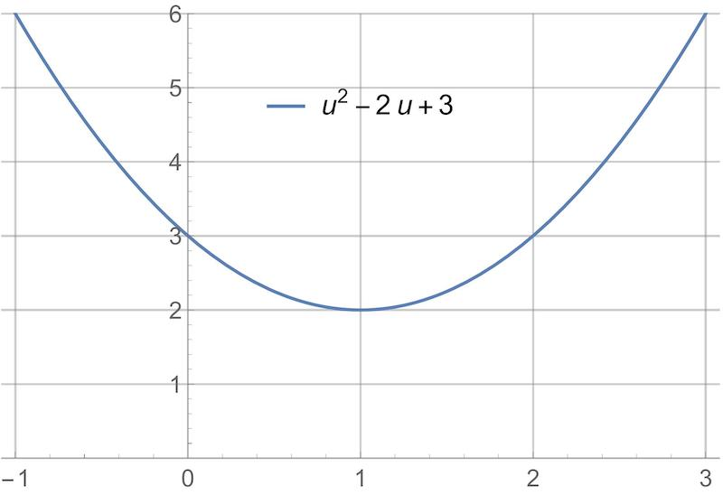
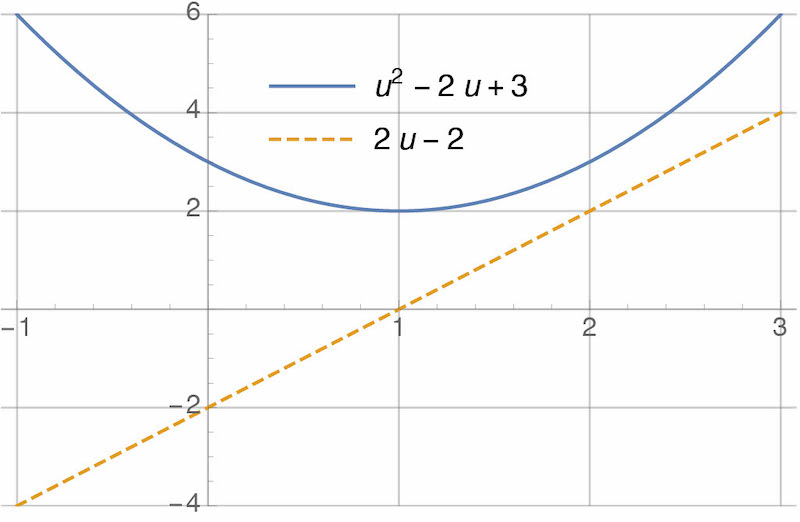
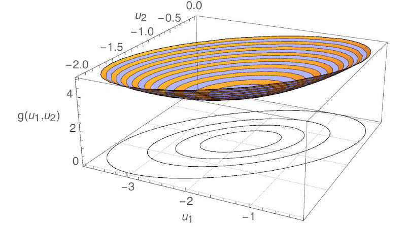
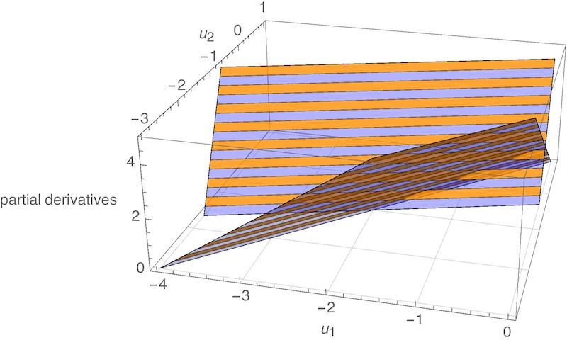

## Contents
{:.no_toc}

* This text will be replaced by a table of contents (excluding the above header) as an unordered list
{:toc}

---

## PID

The **proportional-integral-derivative** or **PID** controller is a simple, widely-used, and often very effective way to make a dynamic system do what you want.

Suppose this dynamic system has exactly one real-valued **input** $u(t)$ and one real-valued **output** $y(t)$. Suppose our goal is to choose the input $u(t)$ so that the output $y(t)$ converges to a desired **reference** value $r$. Define the **error** as

$$
e(t) = y(t) - r.
$$

The PID controller is

$$
u(t) = - k_p e(t) - k_i \int_0^t e(\tau) d\tau - k_d \frac{d e(t)}{dt}
$$

for some choice of constant **gains** $k_p$, $k_i$, and $k_d$. The first term in this controller is "proportional feedback," the second term is "integral feedback," and the third term is "derivative feedback."

#### How to compute the proportional feedback term

We assume the controller is given $r$ and has access to a measurement of $y(t)$, so computing the term

$$
- k_p e(t)
$$

is just arithmetic.

#### How to compute the integral feedback term

To compute the term

$$
- k_i \int_0^t e(\tau) d\tau
$$

we need to find the integral

$$
\int_0^t e(\tau) d\tau
$$

at the current time $t$. In most cases, we cannot find this integral exactly even if we wanted to, because we do not know $y(t)$ --- and, therefore, $e(t)$ --- at *all* times $t \in \mathbb{R}$, but rather only at *sampled* times

$$
t \in \{ 0, \Delta t, 2\Delta t, 3\Delta t, \dotsc \}
$$

for some time step $\Delta t > 0$. For this reason, it is common to use the right-hand rectangle method of numerical integration:

$$
\int_0^t e(\tau) d\tau \approx \int_0^{t - \Delta t} e(\tau) d\tau + \Delta t \cdot e(t).
$$

Here is another way of thinking about this. Suppose we define a new variable

$$
z(t) = \int_0^t e(\tau) d\tau
$$

to contain the integral of the error. It is equivalent to say that $z(t)$ is described by the first-order ordinary differential equation

$$
\frac{d z(t)}{dt} = e(t)
$$

with the initial condition

$$
z(0) = 0.
$$

Then, it is common to use the **backward Euler method**

$$
z(t) \approx z(t - \Delta t) + \Delta t \cdot e(t)
$$

to compute an approximation to $z(t)$. Applying the backward Euler method to find $z(t)$ is exactly the same as applying the right-hand rectangle method to find the integral that $z(t)$ represents.

To implement the backward Euler method with code, you need to define a variable to store the prior value $z(t - \Delta t)$ of the error integral, and you need to update the value of this variable at each time step. You will have to initialize the error integral to something when you start your controller --- it is common to start with a value of zero.

#### How to compute the derivative feedback term

To compute the term

$$
- k_d \frac{d e(t)}{dt}
$$

we need to find the derivative

$$
\frac{d e(t)}{dt}
$$

at the current time $t$. Just like for the integral term, we usually cannot find this derivative exactly. So, just like it is common to use the backward Euler method to find the integral of the error, it is common to use the **backward finite difference method** to find the derivative of the error:

$$
\frac{d e(t)}{dt} \approx \frac{e(t) - e(t - \Delta t)}{\Delta t}.
$$

To implement the backward finite difference method with code, you need to define a variable to store the prior value $e(t - \Delta t)$ of the error, and you need to update the value of this variable at each time step. Again, you will have to initialize this prior error to something when starting your controller --- it is common to start with a value of zero.


## State space models

#### What is a state space model?

A **state-space model** is a set of ordinary differential equations that can be written in this form:

$$
\dot{x} = Ax + Bu
$$

There are two variables:

* $x$ is the **state**
* $u$ is the **input**

Both variables are functions of time, so we could have written $x(t)$ and $u(t)$ --- but in general, we won't use that notation unless we need it. We use dots to indicate time derivatives, so $\dot{x}$ means $dx(t)/dt$.

The state and input may have more than one element --- that is to say, they may be vectors (represented by a matrix of numbers) and not scalars (represented by a single number). Suppose, in particular, that:

* the state $x$ has $n_x$ elements
* the input $u$ has $n_u$ elements

Then, we would represent them as column matrices:

$$
x =
\begin{bmatrix}
x_1 \\ \vdots \\ x_{n_x}
\end{bmatrix}
\qquad
u =
\begin{bmatrix}
u_1 \\ \vdots \\ u_{n_u}
\end{bmatrix}
$$

Taking the time derivative of a matrix is equivalent to taking the time derivative of each element of that matrix, so we would write

$$
\dot{x} =
\begin{bmatrix}
\dot{x}_1 \\ \vdots \\ \dot{x}_{n_x}
\end{bmatrix}
$$

The state-space model also has two constants: $A$ and $B$. If $x$ and $u$ are column matrices with (possibly) more than one element, then these constants have to be matrices as well:

* $A$ is a constant matrix of size $n_x \times n_x$
* $B$ is a constant matrix of size $n_x \times n_u$

The state space model has two key properties:

* it is **linear** because both $\dot{x}$ is a linear function of $x$ and $u$
* it is **time-invariant** because $A$ and $B$ are constant

<div class="alert alert-warning">
Other people use other symbols for both the variables and constants in a state space model. Indeed, we will sometimes use other symbols for these things as well. For example:

$$
\dot{z} = Ez + Fv
$$

This is also a "state space model," in which the state is $z$ and the input is $v$.
</div>


#### How do I put a system in state space form?

Suppose we are given a description of a dynamic system. We would like to describe this same system with a state space model.

Remember that every state space model is linear. The equations of motion that describe a dynamic system are often nonlinear. So apparently, we will have to accept that state space models can only *approximate* some of the systems we want to describe.

We will use **linearization** to arrive at this approximation, in four steps.

**Step 1.** Rewrite the system as a set of first-order ordinary differential equations:

$$
\dot{m} = f(m,n)
$$

In this expression, the variables $m$ and $n$ are functions of time and can have more than one element --- in general, you should represent them as column matrices. As we said before, the function $f(\cdot)$ will often be nonlinear.

**Step 2.** Find an equilibrium point $m_{e}, n_{e}$ of the system by solving this equation:

$$
0 = f(m_{e},n_{e})
$$

A solution to this equation is called an equilibrium point because if

$$m = m_e \qquad n = n_e$$

then

$$\dot{m} = f(m_e, n_e) = 0$$

and so $m$ remains constant. That is to say, if the system reaches an equilibrium point, then it stays there. This is an important property! The goal of almost every controller we design in this course will be to make a system reach an equilibrium point quickly and reliably.

This equation may have no solutions, in which case no equilibrium point exists for the system. This is bad. We will ignore this situation for now.

This equation also may have many solutions, in which case you have to make a choice. A good choice is whatever equilibrium point you would like your system to achieve.

**Step 3.** Define the state and input as follows:

$$
x = m-m_{e}
\qquad
u = n-n_{e}
$$

Note that $x$ measures *error* --- the *difference* between $m$ and its equilibrium value. When error is zero, the system has reached equilibrium and is doing what we want. Apparently, with this way of defining the state and the input, "control design" means choosing $u$ so that $x$ goes to zero.

**Step 4.** Compute $A$ and $B$ as follows:

$$
A = \frac{\partial f}{\partial m}\biggr\rvert_{(m_{e},n_{e})}
\qquad
B = \frac{\partial f}{\partial n}\biggr\rvert_{(m_{e},n_{e})}
$$

<div class="alert alert-warning">
Recall that

$$
\frac{\partial f}{\partial m}\biggr\rvert_{(m_{e},n_{e})}
$$

is the <a href="https://en.wikipedia.org/wiki/Jacobian_matrix_and_determinant">Jacobian (i.e., matrix of partial derivatives)</a> of $f$ with respect to $m$, evaluated at the equilibrium point.
</div>

Why does this make any sense? Look again at the ODEs that describe the original system:

$$\dot{m} = f(m, n)$$

First, because

$$x = m - m_e$$

then

$$\dot{x} = \dot{m} - 0 = \dot{m}$$

So the *left*-hand side of the ODEs can simply be replaced with $\dot{x}$.

Now, suppose we want a linear approximation to the *right*-hand side of the ODEs --- the function $f(m, n)$. One way to find such an approximation is to take a [Taylor's series expansion](https://en.wikipedia.org/wiki/Taylor_series) about $m_e, n_e$ up to first order:

$$
\begin{aligned}
f(m, n)
&\approx f(m_e, n_e) + \frac{\partial f}{\partial m}\biggr\rvert_{(m_{e},n_{e})} \left( m - m_e \right) + \frac{\partial f}{\partial n}\biggr\rvert_{(m_{e},n_{e})} \left( n - n_e \right) \\
&= 0 + A x + B u \\
&= A x + B u
\end{aligned}
$$

There you have it: "$\dot{x} = Ax + Bu$" is a first-order (i.e., linear) approximation to "$\dot{m} = f(m, n)$".


##### Example (first-order)

Consider the system with dynamics that are described by the following equation of motion:

$$\dot{\omega} + 2 \omega = \tau$$

Let's apply our method to put this system in state space form.

We begin by rewriting it as a set of first-order ODEs. Lucky us, the system is already described by just one first-order ODE, so all we need to do is solve for $\dot{w}$:

$$
\dot{\omega} = f(\omega, \tau) = -2\omega + \tau
$$

Next, we find an equilibrium point by solving

$$0 = -2 \omega_e + \tau_e$$

In this case, there are many solutions. Suppose we pick this one:

$$\omega_e = 10 \qquad \tau_e = 20$$

Then, we define the state and input based on this choice of equilibrium point:

$$x = \omega - \omega_e \qquad u = \tau - \tau_e$$

Finally, we compute $A$ and $B$ by taking Jacobians (easy in this case because all the variables are scalars):

$$
\begin{aligned}
A &= \frac{\partial \left(-2\omega + \tau\right)}{\partial \omega}\biggr\rvert_{(\omega_{e},\tau_{e})} = -2 \\[1em]
B &= \frac{\partial \left(-2\omega + \tau\right)}{\partial \tau}\biggr\rvert_{(\omega_{e},\tau_{e})} = 1
\end{aligned}
$$

The resulting state space model is

$$
\begin{aligned}
\dot{x} &= Ax + Bu \\
&= -2x + u
\end{aligned}
$$

Note that the original system was linear, so there was no approximation here. We could probably have skipped most of these steps and written the system in state-space form by inspection. On the other hand, it is nice to know that the process of "linearization" still works even in this simple case.


##### Example (second-order)

Consider the system with dynamics that are described by the following equation of motion:

$$\ddot{q} + 3 \sin q = \tau$$

Let's apply our method to put this system in state-space form.

We begin by rewriting it as a set of first-order ODEs:

* We find the time-derivative of $q$ with highest order --- in this case, $\ddot{q}$, of order 2.
* We define *new variables* for each time-derivative of $q$ with lower order --- in this case, $\dot{q}$, the only time-derivative with order between 0 and 2. We might choose the following name for this time-derivative:

$$ v = \dot{q} $$

* We rewrite the original ODEs (in this case, just one) in terms of these new variables:

$$\dot{v} + 3\sin q = \tau$$

* We add one extra ODE for each new variable (in this case, just one extra) --- this is trivial, coming from the way we defined these new variables:

$$\dot{q} = v$$

* We collect the original ODEs and the extra ODEs together, if necessary solving for all of the time-derivatives (that's not necessary here):

$$
\begin{aligned}
\dot{q} &= v \\
\dot{v} &= -3\sin q + \tau
\end{aligned}
$$

* Finally, we rewrite our result in the form $\dot{m} = f(m, n)$ by collecting things in column matrices as follows:

$$\begin{bmatrix} \dot{q} \\ \dot{v} \end{bmatrix} = \begin{bmatrix} v \\ -3\sin q + \tau \end{bmatrix}$$

Note that, as desired, these rewritten ODEs have time derivatives that are at most of first order. Also note that all of these time-derivatives are on the left-hand side of the equations --- none appear on the right-hand side.

Next, we find an equilibrium point by solving

$$\begin{bmatrix} 0 \\ 0 \end{bmatrix} = \begin{bmatrix} v \\ -3\sin q + \tau \end{bmatrix}$$

There are many solutions. Suppose we pick this one:

In this case, there are many solutions. Suppose we pick this one:

$$q_e = \pi / 2 \qquad v_e = 0 \qquad \tau_e = 3$$

Then, we define the state and input based on this choice of equilibrium point:

$$x = \begin{bmatrix} q - q_e \\ v - v_e \end{bmatrix} \qquad u = \begin{bmatrix}\tau - \tau_e\end{bmatrix}$$

Finally, we compute $A$ and $B$ by taking Jacobians.

$$
\begin{aligned}
A
&= \frac{\partial f}{\partial \begin{bmatrix} q \\ v \end{bmatrix}}\biggr\rvert_{\left(\begin{bmatrix}q_e\\v_e\end{bmatrix},\begin{bmatrix}\tau_{e}\end{bmatrix}\right)} \\
&= \left.\begin{bmatrix} \dfrac{\partial(v)}{\partial q} & \dfrac{\partial(v)}{\partial v} \\ \dfrac{\partial(-3\sin q + \tau)}{\partial q} & \dfrac{\partial(-3\sin q + \tau)}{\partial v} \end{bmatrix}\right\rvert_{\left(\begin{bmatrix}q_e\\v_e\end{bmatrix},\begin{bmatrix}\tau_{e}\end{bmatrix}\right)} \\
&= \left.\begin{bmatrix} 0 & 1 \\ -3\cos q & 0 \end{bmatrix}\right\rvert_{\left(\begin{bmatrix}q_e\\v_e\end{bmatrix},\begin{bmatrix}\tau_{e}\end{bmatrix}\right)} \\
&= \begin{bmatrix} 0 & 1 \\ 0 & 0 \end{bmatrix} \\[1em]
B
&= \frac{\partial f}{\partial \begin{bmatrix} \tau \end{bmatrix}}\biggr\rvert_{\left(\begin{bmatrix}q_e\\v_e\end{bmatrix},\begin{bmatrix}\tau_{e}\end{bmatrix}\right)} \\
&= \left.\begin{bmatrix} \dfrac{\partial(v)}{\partial \tau} \\ \dfrac{\partial(-3\sin q + \tau)}{\partial \tau} \end{bmatrix}\right\rvert_{\left(\begin{bmatrix}q_e\\v_e\end{bmatrix},\begin{bmatrix}\tau_{e}\end{bmatrix}\right)} \\
&= \left.\begin{bmatrix} 0 \\ 1 \end{bmatrix}\right\rvert_{\left(\begin{bmatrix}q_e\\v_e\end{bmatrix},\begin{bmatrix}\tau_{e}\end{bmatrix}\right)} \\
&= \begin{bmatrix} 0 \\ 1 \end{bmatrix}
\end{aligned}
$$

The resulting state space model is

$$
\begin{aligned}
\dot{x} &= Ax + Bu \\
&= \begin{bmatrix} 0 & 1 \\ 0 & 0 \end{bmatrix}x + \begin{bmatrix} 0 \\ 1 \end{bmatrix}u
\end{aligned}
$$

The original system was nonlinear and the state space model is linear, so there *must* be some approximation here! As we will see, this approximation is good near the equilibrium point but can be very bad elsewhere.


## The matrix exponential function

#### What is the matrix exponential?

The **matrix exponential** of a square matrix $M$ is the infinite series

$$
e^M = I + M + \frac{1}{2}M^2 + \frac{1}{6}M^3 + \dotsm = \sum_{k=0}^{\infty} \dfrac{1}{k !} M^k
$$

where $I$ is the identity matrix. This series converges for any square matrix $M$.


#### How do I use the matrix exponential to solve a linear system?

The solution to the set of linear ODEs

$$ \dot{x} = Fx $$

with the initial condition

$$ x(t_0) = x_0 $$

is

$$ x(t) = e^{F (t - t_0)} x_0. $$

How do we know that this solution is correct? First, let's check that this solution satisfies the ODEs:

$$
\begin{aligned}
\dot{x}
&= \frac{d}{dt} \left( e^{F (t - t_0)} x_0 \right) \\
&= \frac{d}{dt} \left( \left( I + F(t-t_0) + \frac{1}{2} F^2(t-t_0)^2 + \frac{1}{6} F^2(t-t_0)^3 + \dotsm \right) x_0 \right) \\
&= \frac{d}{dt} \left( I + F(t-t_0) + \frac{1}{2} F^2(t-t_0)^2 + \frac{1}{6} F^3(t-t_0)^3 + \dotsm \right) x_0 \\
&= \left( \frac{d}{dt} \left( I \right) + \frac{d}{dt} \left( F(t-t_0) \right) + \frac{d}{dt} \left( \frac{1}{2} F^2(t-t_0)^2 \right) + \frac{d}{dt} \left( \frac{1}{6} F^3(t-t_0)^3 \right) \dotsm \right) x_0 \\
&= \left( 0 + F + F^2(t-t_0) + \frac{1}{2} F^3(t-t_0) + \dotsm \right) x_0 \\
&= F \left(I + F(t-t_0) + \frac{1}{2} F^2(t-t_0)^2 + \dotsm \right) x_0 \\
&= F e^{F(t-t_0)} x_0
\end{aligned}
$$

Apparently, it does. Second, let's check that this solution satisfies the initial condition:

$$ \begin{aligned} x(t_0) &= e^{F(t_0 - t_0)} x_0 \\ &= e^0 x_0 \\ &= I x_0 \\ &= x_0 \end{aligned} $$

Again, it does. (We might wonder if this is the *only* solution to the original ODEs --- it is, although a proof would require more work.)

#### How do I use the matrix exponential to solve state space models?

Consider the state space model

$$ \dot{x} = Ax + Bu$$

This model does not look the same as

$$ \dot{x} = Fx $$

Indeed, without specifying $u$, we cannot solve for $x$ as a function of time. However, particular choices of $u$ allow us to simplify the state space model. For example, if we choose $u = 0$, then we can write

$$ \begin{aligned} \dot{x} &= Ax+Bu \\ &= Ax + B \cdot (0) \\ &= Ax + 0 \\ &= Ax \end{aligned} $$

and so we are right back at a linear system that can be solved with the matrix exponential. Another common choice of $u$ is

$$ u = -Kx $$

for some constant matrix $K$. (What would the size of $K$ have to be for us to define $u$ in this way?) This choice of $u$ is called **state feedback**, since the input depends on the state. If we plug this choice into our state space model, then we can write

$$
\begin{aligned}
\dot{x} &= Ax + Bu \\
&= Ax + B(-Kx) \\
&= (A - BK) x
\end{aligned}
$$

and so --- just like before --- we are right back at a linear system that can be solved with the matrix exponential. Although this result will get us a long way, we will see how to solve state space models for other choices of input later on.

<div class="alert alert-warning">
Given the state-space model

$$\dot{x} = Ax + Bu$$

it is standard to call the system

$$\dot{x} = Ax$$

that results from the application of zero input $u=0$ the <strong>open-loop system</strong>. Similarly, it is standard to call the system

$$\dot{x} = (A - BK) x$$

that results from the application of linear state feedback $u = -Kx$ the <strong>closed-loop system</strong>. Remember that "zero input" is not necessarily the same as "zero actuator commands." When <a href="#how-do-i-put-a-system-in-state-space-form">linearizing equations of motion to derive a state space model</a>, we defined

$$u = n - n_e$$

where $n$ was the set of actuator commands and $n_e$ was the value of these commands at equilibrium. So,

$$u = 0$$

actually means

$$n = n_e.$$

Similarly,

$$u = -Kx$$

actually means

$$n = n_e - Kx = n_e - K(m - m_e).$$

The term $n_e$ is typically referred to as <strong>feedforward</strong> and the term $-K(m - m_e)$ is typically referred to as <strong>feedback</strong>.
</div>


## Asymptotic stability

#### What are eigenvalues and eigenvectors?

Consider a square matrix $F \in \mathbb{R}^{n \times n}$. If we can find a complex number $s \in \mathbb{C}$ and a non-zero, complex-valued vector $v \in \mathbb{C}^n$ that satisfy

$$ (s I - F) v = 0 $$

then we call $s$ an **eigenvalue** of $F$ and $v$ the corresponding **eigenvector** of $F$. If we wanted, we could rearrange this equation to put it in a form that might be more familiar:

$$ 0 = (s I - F) v = s v - F v \qquad\Rightarrow\qquad F v = s v. $$

One way to find eigenvalues is to solve the equation

$$ \det (s I - F) = 0 $$

where "$\det(\cdot)$" means taking a determinant. In general, this equation will be an $n$th-order polynomial in $s$, and so will have $n$ solutions --- we might call them $s_1, \dotsc, s_n$. To find an eigenvector that corresponds to each eigenvalue $s_i$, we solve

$$ F v_i = s_i v_i $$

for $v_i$. Note that there are many possible solutions to this equation and that eigenvectors are only unique up to a scale factor. In particular, for any real number $k \in \mathbb{R}$, we have

$$ \begin{aligned} F (k v_i) &= k (F v_i) \\ &= k (s v_i) \\ &= s (k v_i). \end{aligned}$$

Apparently, if $v_i$ is an eigenvector corresponding to $s_i$, then so is $k v_i$ for any $k \neq 0$. For this reason, algorithms to find eigenvectors typically *normalize* them to have unit length.

#### How do I diagonalize a square matrix?

Suppose we have found the eigenvalues $s_1, \dotsc, s_n$ and eigenvectors $v_1, \dotsc, v_n$ of a square matrix $F\in\mathbb{R}^{n \times n}$. Define the matrix

$$V = \begin{bmatrix} v_1 & \dotsm & v_n \end{bmatrix}$$

with an eigenvector in each column, and also the matrix

$$\text{diag} (s_1, \dotsc, s_n) = \begin{bmatrix} s_1 & 0 & \dotsm & 0 \\ 0 & s_2 & \dotsm & 0 \\ \vdots & \vdots & \ddots & \vdots \\ 0 & 0 & \dotsm & s_n \end{bmatrix}$$

with the eigenvalues along the diagonal.

Two things are true.

First, the following equality holds:

$$F V = V \text{diag} (s_1, \dotsc, s_n) $$

You could easily verify this result for yourself.

Second, if $s_1, \dotsc, s_n$ are all *distinct* (i.e., if no two eigenvalues are the same), then the matrix $V$ is *invertible*. This result is harder to verify --- it has to do with the fact that if the eigenvalues are distinct then the eigenvectors are linearly independent.

The key consequence of $V$ being invertible is that we can solve the above equality to write:

$$\text{diag} (s_1, \dotsc, s_n) = V^{-1} F V.$$

In this case --- if all eigenvalues are distinct and so the matrix of eigenvectors is invertible --- we say that $F$ is **diagonalizable**. The process of "diagonalizing $F$" is finding the matrix $V$.

#### What is the matrix exponential of a diagonal matrix?

It is easy to find the matrix exponential of a diagonal matrix, starting from [the definition](#what-is-the-matrix-exponential):

$$
\begin{align*}
e^{\text{diag} (s_1, \dotsc, s_n)t}
&= I + \text{diag} (s_1, \dotsc, s_n)t + \frac{1}{2}\left( \text{diag} (s_1, \dotsc, s_n) t \right)^2 + \dotsm \\
&=
\begin{bmatrix} 1 & 0 & \dotsm & 0 \\ 0 & 1 & \dotsm & 0 \\ \vdots & \vdots & \ddots & \vdots \\ 0 & 0 & \dotsm & 1 \end{bmatrix}
+
\begin{bmatrix} s_1t & 0 & \dotsm & 0 \\ 0 & s_2t & \dotsm & 0 \\ \vdots & \vdots & \ddots & \vdots \\ 0 & 0 & \dotsm & s_nt \end{bmatrix}
+
\begin{bmatrix} (s_1t)^2/2 & 0 & \dotsm & 0 \\ 0 & (s_2t)^2/2 & \dotsm & 0 \\ \vdots & \vdots & \ddots & \vdots \\ 0 & 0 & \dotsm & (s_nt)^2/2 \end{bmatrix}
+ \dotsm \\
&= \begin{bmatrix} 1 + s_1t + (s_1t)^2/2 + \dotsm & 0 & \dotsm & 0 \\ 0 & 1 + s_2t + (s_2t)^2/2 + \dotsm & \dotsm & 0 \\ \vdots & \vdots & \ddots & \vdots \\ 0 & 0 & \dotsm & 1 + s_nt + (s_nt)^2/2 + \dotsm \end{bmatrix} \\
&= \begin{bmatrix} e^{s_1t} & 0 & \dotsm & 0 \\ 0 & e^{s_2t} & \dotsm & 0 \\ \vdots & \vdots & \ddots & \vdots \\ 0 & 0 & \dotsm & e^{s_nt} \end{bmatrix}
\end{align*}
$$

#### What is the solution to a linear system that is diagonalizable?

[We have seen](#how-do-i-use-the-matrix-exponential-to-solve-a-linear-system) that the solution to

$$\dot{x} = Fx$$

with the initial condition

$$x(0) = x_0$$

is

$$x(t) = e^{Ft}x_0.$$

Suppose $F$ is a diagonalizable matrix, so that

$$\text{diag} (s_1, \dotsc, s_n) = V^{-1} F V$$

where

$$\text{diag} (s_1, \dotsc, s_n)$$

is a diagonal matrix that contains the eigenvalues of $F$ and where

$$V = \begin{bmatrix} v_1 & \dotsm & v_n \end{bmatrix}$$

is a matrix of the corresponding eigenvectors. Then, applying [the definition of matrix exponential](#what-is-the-matrix-exponential) again, we have

$$
\begin{align*}
e^{Ft}x_0
&= e^{V \text{diag} (s_1, \dotsc, s_n) V^{-1}t}x_0 \\
&= \left( I + V \text{diag} (s_1, \dotsc, s_n) V^{-1}t + \frac{1}{2}\left( V \text{diag} (s_1, \dotsc, s_n) V^{-1}t \right)^2 + \dotsm\right) x_0 \\
&= V \left( I + \text{diag} (s_1, \dotsc, s_n) t + \frac{1}{2} \left( \text{diag} (s_1, \dotsc, s_n)t \right)^2 + \dotsm\right) V^{-1}x_0 \\
&= V e^{\text{diag} (s_1, \dotsc, s_n)t}V^{-1}x_0 \\
&= V \begin{bmatrix} e^{s_1t} & 0 & \dotsm & 0 \\ 0 & e^{s_2t} & \dotsm & 0 \\ \vdots & \vdots & \ddots & \vdots \\ 0 & 0 & \dotsm & e^{s_nt} \end{bmatrix} V^{-1}x_0
\end{align*}
$$

where the last step comes from what we just found out about the [matrix exponential of a diagonal matrix](#what-is-the-matrix-exponential-of-a-diagonal-matrix). In this expression, the terms $V$, $V^{-1}$, and $x_0$ are constant. The only terms that depend on $t$, in fact, are the *scalar* exponential functions

$$e^{s_1t}, \dotsc, e^{s_nt}$$

that appear in the diagonal of

$$e^{\text{diag} (s_1, \dotsc, s_n)t}.$$

Therefore, we can infer the behavior of $x(t)$ based entirely on these scalar exponential functions. In particular, suppose that each eigenvalue $s_i$ — a complex number — has real part $a_i$ and imaginary part $b_i$, or in other words that

$$s_i = a_i + jb_i.$$

[Euler's formula](https://en.wikipedia.org/wiki/Euler%27s_formula) tells us that

$$e^{s_it} = e^{(a_i+jb_i)t} = e^{a_it}\left(\cos(b_it) + j\sin(b_it)\right).$$

Apparently, as time gets large, one of three things is true about each of these terms:

* if $a_i > 0$, then $e^{(a_i+jb_i)t}$ grows quickly
* if $a_i = 0$, then $e^{(a_i+jb_i)t}$ is constant ($b_i=0$) or is sinusoidal with constant magnitude ($b_i \neq 0$)
* if $a_i < 0$, then $e^{(a_i+jb_i)t}$ decays quickly to zero

It is possible to show that (more or less) the same result holds for *any* system $\dot{x}=Fx$, not only ones for which $F$ is diagonalizable. This takes more work, and involves the transformation of $F$ into [Jordan normal form](https://en.wikipedia.org/wiki/Jordan_normal_form) rather than into a diagonal matrix. We would discover that the terms that depend on $t$ all look like

$$t^me^{s_it}$$

where $m$ is an integer that is at most the multiplicity of the eigenvalue $s_i$. Since $e^{a_it}$ increases or decreases a lot faster than $t^m$, then the same three things we listed above would be true of each term in $x(t)$, just like before.

See [the reference textbook](https://fbswiki.org/) for details.

#### When is a linear system asymptotically stable?

The system

$$\dot{x} = Fx$$

is called **asymptotically stable** if $x(t) \rightarrow 0$ as $t \rightarrow \infty$, starting from any initial condition $x(t_0) = x_0.$

Based on our observations about [the solution to linear systems that are diagonalizable](#what-is-the-solution-to-a-linear-system-that-is-diagonalizable), we can state the following important result:

<div class="alert alert-warning">
The system

$$\dot{x} = Fx$$

is asymptotically stable if and only if all eigenvalues of $F$ have negative real part.
</div>

In particular, we now have a test for whether or not a controller "works." Suppose we apply linear state feedback

$$u = -Kx$$

to the state space system

$$\dot{x} = Ax + Bu$$

so that

$$\dot{x} = (A - BK)x.$$

The controller "works" when this system is asymptotically stable, i.e., when $x$ goes to zero as time gets large. We now know, therefore, that the controller "works" when all eigenvalues of $A - BK$ have negative real part.

We may not have a systematic way of *finding* a matrix $K$ to make the closed-loop system stable yet, but we certainly do have a systematic way now of deciding whether or not a *given* matrix $K$ makes the closed-loop system stable.


## Eigenvalue placement by controllable canonical form

Apply the input

$$u=-Kx$$

to the open-loop system

$$\dot{x} = Ax+Bu $$

and you get the closed-loop system

$$\dot{x} = (A-BK)x.$$

Suppose we want to choose $K$ to put the eigenvalues of the closed-loop system, i.e., the eigenvalues of the matrix $A-BK$, at given locations. We will derive a formula called **Ackermann's method** that allows us to do this when possible, and will show how to decide when doing so is impossible.

<div class="alert alert-danger">
<p>
This entire discussion will be based on the assumption that there is exactly one input (i.e., that $u$ is a vector of length $1$, or that $n_u = 1$). Ackermann's method, in particular, <em>cannot be used</em> for eigenvalue placement when there is more than one input.
</p>

However, other similar methods — for example, the method of Tits and Yang (<a href="https://doi.org/10.1109/9.539425">"Globally convergent algorithms for robust pole assignment by state feedback," <em>IEEE Transactions on Automatic Control</em>, 41:1432-1452, 1996)</a>, as implemented by <a href="https://docs.scipy.org/doc/scipy/reference/generated/scipy.signal.place_poles.html#scipy-signal-place-poles">scipy.signal.place_poles</a> in python — <em>can</em> be used when there are multiple inputs. Our result about when eigenvalue placement is possible — i.e., about when a system is "controllable" — also generalizes to systems with multiple inputs, although it becomes harder to prove.
</div>

#### Eigenvalues are invariant to coordinate transformation


Consider the system

$$\dot{x} = Ax+Bu.$$

Suppose we define a new state variable $z$ so that

$$x = Vz$$

for some invertible matrix $V$, and so

$$\dot{x} = V\dot{z}$$

by differentiation. We have called this process "coordinate transformation" — it is exactly the same process we used for diagonalization when establishing our result about asymptotic stability.
Plug these two things into our original state-space model and we get


$$V\dot{z} = AVz+Bu.$$

Solve for $\dot{z}$ and we get the equivalent state-space model

$$\dot{z} = V^{-1}AV z + V^{-1}B u.$$

Finding a solution $z(t)$ to this transformed system allows us to recover a solution

$$x(t) = Vz(t)$$

to the original system. We would like to know if these two solutions "behave" the same way. In particular, we would like to know if the eigenvalues of $A$ are the same as the eigenvalues of $V^{-1}AV$.

First, let's look at the eigenvalues of $A$. We know that they are the roots of

$$\det\left(sI-A\right).$$

Second, let's look at the eigenvalues of $V^{-1}AV$. We know that they are the roots of

$$\det\left( sI-V^{-1}AV \right)$$

We can play a trick.
Notice that

$$V^{-1}(sI)V = s V^{-1}V = sI$$

and so

$$
\begin{align*}
\det\left( sI-V^{-1}AV \right)
&= \det\left( V^{-1}(sI)V-V^{-1}AV \right) && \text{because of our trick} \\
&= \det\left( V^{-1}(sI - A) V \right).
\end{align*}
$$

It is a fact that

$$\det(MN)=\det(M)\det(N)$$

for any square matrices $M$ and $N$.
Applying this fact, we find

$$\det\left( V^{-1}(sI - A) V \right) = \det(V^{-1})\det(sI-A)\det(V).$$

It is another fact that

$$\det(M^{-1}) = (\det(M))^{-1} = \dfrac{1}{\det(M)}$$

Applying this other fact, we find

$$
\det(V^{-1})\det(sI-A)\det(V)
= \dfrac{\det(sI-A)\det(V)}{\det(V)}
= \det(sI-A)
$$

In summary, we have established that

$$\det(sI-A) = \det\left( sI-V^{-1}AV \right)$$

and so the eigenvalues of $A$ and $V^{-1}AV$ are the same. The consequence is, if you design state feedback for the transformed system, you'll recover the behavior you want for the original system. In particular, suppose you apply the input

$$u = -Lz$$

to the transformed system and choose $L$ to place the eigenvalues of $V^{-1}AV$ in given locations.
Applying the input

$$u = -LV^{-1}x$$

to the original system, i.e., choosing

$$K = LV^{-1},$$

will result in placing the eigenvalues of $A$ at these same locations. The reason this is important is that it is often easier to choose $L$ than to choose $K$. The process of [diagonalization](#what-is-the-solution-to-a-linear-system-that-is-diagonalizable) was important for a similar reason.

#### Controllable canonical form

In the previous section, we showed that eigenvalues are invariant to coordinate transformation. The next question is what coordinates are useful for control design. The answer to that question turns out to be something called **controllable canonical form.**

A system with $n_x$ states and $1$ input is in controllable canonical form if it looks like

$$\dot{z} = A_\text{ccf}z + B_\text{ccf} u$$

where

$$
A_\text{ccf} =
\begin{bmatrix}
-a_{1} & -a_{2} & \dotsm & -a_{n_x-1} & -a_{n_x} \\
1 & 0 & \dotsm & 0 & 0 \\
0 & 1 & \dotsm & 0 & 0 \\
\vdots & \vdots & \ddots & \vdots & \vdots \\
0 & 0 & \dotsm & 1 & 0
\end{bmatrix}
\qquad\qquad
B_\text{ccf} = \begin{bmatrix} 1 \\ 0 \\ 0 \\ \vdots \\ 0 \end{bmatrix}.
$$

Notice that

* $A_\text{ccf}$ is a matrix of size $n_x \times n_x$,
* $B_\text{ccf}$ is a matrix of size $n_x \times 1$,
* $z$ is a vector of length $n_x$, and
* $u$ is a vector of length $1$.

It is a fact that the characteristic equation of this system is given by

$$\det(sI-A_\text{ccf}) = s^{n_x} + a_{1}s^{n_x-1} + \dotsm + a_{n_x-1}s + a_{n_x}.$$

It is easy to see that this formula is true for $n_x=2$ and $n_x=3$. In particular:


* If $n_x=2$, then:

$$
\begin{align*}
\det(sI-A_\text{ccf})
&= \det\begin{bmatrix} s+a_{1} & a_{2} \\ -1 & s \end{bmatrix} \\
&= (s+a_{1})s+a_{2} = s^{2}+a_{1}s+a_{2}.
\end{align*}
$$

* If $n_x=3$, then:

$$
\begin{align*}
\det(sI-A_\text{ccf})
&= \det\begin{bmatrix} s+a_{1} & a_{2} & a_{3}\\ -1 & s & 0 \\ 0 & -1 & s \end{bmatrix} \\
&= (s+a_{1})s^{2}+a_{3}-(-a_{2}s)= s^{3}+a_{1}s^{2}+a_{2}s+a_{3}.
\end{align*}
$$

There are a variety of ways to prove that this same formula is true in general. Applying the general formula to compute the matrix determinant, for example, we would find:

$$
\begin{align*}
\det(sI-A_\text{ccf})
&= \det
\begin{bmatrix}
s+a_{1} & a_{2} & \dotsm & a_{n_x-1} & a_{n_x} \\
-1 & s & \dotsm & 0 & 0 \\
0 & -1 & \dotsm & 0 & 0 \\
\vdots & \vdots & \ddots & \vdots & \vdots \\
0 & 0 & \dotsm & -1 & s
\end{bmatrix} \\
&= (s+a_{1}) \det(T_{1})-a_{2}\det(T_{2})+a_{3}\det(T_{3})-\dotsm
\end{align*}
$$

where each matrix $T_{i}$ is upper-triangular with $-1$ in $i-1$ diagonal entries and $s$ in $n_x-i$ diagonal entries. Since the determinant of an upper-triangular matrix is the product of its diagonal entries, we have

$$
\det(T_{i}) = \begin{cases} s^{n_x-i} & \text{when $i$ is odd} \\ -s^{n_x-i} & \text{when $i$ is even} \end{cases}
$$

Plug this in, and our result follows.
Now, the reason that controllable canonical form is useful is that if we choose the input

$$
u = -Lz
$$

for some choice of gains

$$
L = \begin{bmatrix} \ell_{1} & \dotsm & \ell_{n_x} \end{bmatrix}
$$

then the "$A$ matrix" of the closed-loop system is

$$
A_\text{ccf}-B_\text{ccf}L =
\begin{bmatrix}
-a_{1}-\ell_{1} & -a_{2}-\ell_{2} & \dotsm & -a_{n_x-1}-\ell_{n_x-1} & -a_{n_x}-\ell_{n_x} \\
1 & 0 & \dotsm & 0 & 0 \\
0 & 1 & \dotsm & 0 & 0 \\
\vdots & \vdots & \ddots & \vdots & \vdots \\
0 & 0 & \dotsm & 1 & 0
\end{bmatrix}
$$

The characteristic equation of this closed-loop system, computed in the same way as for $A_\text{ccf}$, is

$$
s^{n_x} + (a_{1}+\ell_{1}) s^{n_x-1} + \dotsm + (a_{n_x-1}+\ell_{n_x-1}) s + (a_{n_x}+\ell_{n_x}).
$$

If you want this characteristic equation to look like

$$
s^{n_x} + r_{1} s^{n_x-1} + \dotsm + r_{n_x-1} s + r_{n_x}
$$

then it's obvious what gains you should choose

$$
\ell_{1} = r_{1}-a_{1} \qquad\qquad \ell_{2} = r_{2}-a_{2} \qquad\qquad \dotsm \qquad\qquad \ell_{n_x}=r_{n_x}-a_{n_x}.
$$

So, if you have a system in controllable canonical form, then it is easy to choose gains that make the characteristic equation of the closed-loop system look like anything you want (i.e., to put the closed-loop eigenvalues anywhere you want). In other words, it is easy to do control design.


#### Putting a system in controllable canonical form

We have seen that controllable canonical form is useful. Now we'll see how to put a system in this form.
Suppose we have a system

$$
\dot{x} = Ax+Bu
$$

and we want to choose an invertible matrix $V$ so that if we define a new state variable $z$ by

$$
x = Vz
$$

then we can rewrite the system as

$$
\dot{z} = A_\text{ccf}z+B_\text{ccf}u
$$

where

$$
A_\text{ccf} = V^{-1}AV
\qquad\qquad\text{and}\qquad\qquad
B_\text{ccf} = V^{-1}B
$$

are in controllable canonical form.
The trick is to look at the so-called **controllability matrix** that is associated with the transformed system:

$$
W_\text{ccf} = \begin{bmatrix} B_\text{ccf} & A_\text{ccf}B_\text{ccf} & \dotsm & A_\text{ccf}^{n_x-1}B_\text{ccf} \end{bmatrix}.
$$

We will talk more later about the controllability matrix — for now, notice that

$$
\begin{align*}
B_\text{ccf} &= V^{-1}B \\
A_\text{ccf}B_\text{ccf} &= V^{-1}AVV^{-1}B = V^{-1}AB \\
A_\text{ccf}^{2}B_\text{ccf} &= A_\text{ccf} (A_\text{ccf}B_\text{ccf}) = V^{-1}AVV^{-1}AB = V^{-1}A^{2}B \\
\vdots\qquad &= \qquad\vdots
\end{align*}
$$

You see the pattern here, I'm sure. The result is:

$$
\begin{align*}
W_\text{ccf} &= \begin{bmatrix} V^{-1}B & V^{-1}AB & \dotsm & V^{-1}A^{n_x-1}B \end{bmatrix} \\
&= V^{-1}\begin{bmatrix} B & AB & \dotsm & A^{n_x-1}B \end{bmatrix} \\
&= V^{-1}W
\end{align*}
$$

where

$$
W = \begin{bmatrix} B & AB & \dotsm & A^{n_x-1}B \end{bmatrix}
$$

is the controllability matrix associated with the original system.

There are three things to note:

* $A$ and $B$ are things that you know — you have a description of the original system, as always — so you can compute $W$.

* $A_\text{ccf}$ and $B_\text{ccf}$ are also things that you know — the values $a_1, \dotsc, a_{n_x}$ in the top row of $A_\text{ccf}$ are the coefficients of the characteristic polynomial of the matrix $A$ — so you can compute $W_\text{ccf}$.

* $W$ is a square $n_x \times n_x$ matrix — it has $n_x$ columns $B$, $AB$, and so forth, all of which have size $n_x \times 1$. So, if $W$ has non-zero determinant, then you can find its inverse.

As a consequence, you can solve for the matrix $V^{-1}$:

$$
V^{-1} = W_\text{ccf}W^{-1}.
$$

Now, suppose you design a control policy for the transformed system:

$$
u = -K_\text{ccf}z.
$$

Remember, you can do this easily, because the transformed system is in controllable canonical form.
We can compute the equivalent control policy, that would be applied to the original system:

$$
u = -K_\text{ccf}z = -K_\text{ccf}V^{-1}x = -K_\text{ccf}W_\text{ccf}W^{-1}x.
$$

In particular, if we choose

$$
K = K_\text{ccf}W_\text{ccf}W^{-1}
$$

then we get the behavior that we want.
Again, we emphasize that this only works if $W$ is invertible, and that $W$ is only invertible if $\det(W)\neq 0$.

#### A systematic process for control design

Apply the input

$$
u=-Kx
$$

to the open-loop system

$$
\dot{x} = Ax+Bu
$$

and you get the closed-loop system

$$
\dot{x} = (A-BK)x.
$$

Suppose we want to choose $K$ to put the eigenvalues of the closed-loop system at

$$p_{1},\dotsc,p_{n_x}.$$

Using the results of the previous sections, we know we can do this as follows:

* Compute the characteristic equation that we want:

$$(s-p_{1})\dotsm(s-p_{n_x}) = s^{n_x}+r_{1}s^{n_x-1}+ \dotsm + r_{n_x-1}s + r_{n_x}.$$

* Compute the characteristic equation that we have:

$$\det(sI-A) = s^{n_x}+a_{1}s^{n_x-1}+ \dotsm + a_{n_x-1}s + a_{n_x}$$


* Compute the controllability matrix of the original system (and check that $\det(W)\neq 0$):

$$W = \begin{bmatrix} B & AB & \dotsm & A^{n_x-1}B \end{bmatrix}$$


* Compute the controllability matrix of the transformed system:

$$
W_\text{ccf} = \begin{bmatrix} B_\text{ccf} & A_\text{ccf}B_\text{ccf} & \dotsm & A_\text{ccf}^{n_x-1}B_\text{ccf} \end{bmatrix}
$$

&nbsp;&nbsp;&nbsp;&nbsp;&nbsp;&nbsp;&nbsp;where

$$
A_\text{ccf} =
\begin{bmatrix}
-a_{1} & -a_{2} & \dotsm & -a_{n-1} & -a_{n} \\
1 & 0 & \dotsm & 0 & 0 \\
0 & 1 & \dotsm & 0 & 0 \\
\vdots & \vdots & \ddots & \vdots & \vdots \\
0 & 0 & \dotsm & 1 & 0
\end{bmatrix}
\qquad\qquad
B_\text{ccf} = \begin{bmatrix} 1 \\ 0 \\ 0 \\ \vdots \\ 0 \end{bmatrix}
$$

* Compute the gains for the transformed system:

$$
K_\text{ccf} = \begin{bmatrix} r_{1}-a_{1} & \dotsm & r_{n_x}-a_{n_x} \end{bmatrix}
$$

* Compute the gains for the original system:

$$
K = K_\text{ccf}W_\text{ccf}W^{-1}
$$

And we're done!
This process is easy to implement, without any symbolic computation.
Remember, although this method only works for systems with exactly one input (i.e., when $n_u = 1$), similar methods work for systems with multiple inputs — in python, use <a href="https://docs.scipy.org/doc/scipy/reference/generated/scipy.signal.place_poles.html#scipy-signal-place-poles">scipy.signal.place_poles</a>.

#### How to decide when eigenvalue placement is possible

We say that a system is **controllable** if eigenvalue placement is possible. We have seen eigenvalue placement with Ackermann's method (for the special case when $n_u = 1$) is only possible when the controllability matrix $W$ is invertible. Here is a generalization of that same result to any system:


<div class="alert alert-warning">
The system

$$\dot{x} = Ax+Bu$$

is <strong>controllable</strong> if and only if
the <strong>controllability matrix</strong>

$$W = \begin{bmatrix} B & AB & \dotsm & A^{n_x-1}B \end{bmatrix}$$

is full rank, where $n_x$ is the number of states.
</div>

Let's break this statement down.

First, suppose there is only one input, so $n_u = 1$.  In that case, $A$ has size $n_x \times n_x$ and $B$ has size $n_x \times 1$. Therefore, $W$ is a square matrix of size $n_x \times n_x$, so $W$ being full rank simply means that it is invertible (i.e., that $\det(W) \neq 0$).

Now, suppose there is more than one input, so $n_u > 1$. Then, $B$ has size $n_x \times n_u$.  The matrix $W$ then has size $n_x \times n_xn_u$, and $W$ is no longer square. Although we can't invert a non-square matrix, we can still find its [rank](https://en.wikipedia.org/wiki/Rank_(linear_algebra)). In particular, it is easy to find the rank of a non-square matrix in python using [numpy.linalg.matrix_rank](https://numpy.org/doc/stable/reference/generated/numpy.linalg.matrix_rank.html#numpy-linalg-matrix-rank). We say that $W$ is **full rank** if and only if its rank is $n_x$.

If $W$ is full rank, the system is controllable, and eigenvalue placement will work. If $W$ is not full rank, the system is not controllable, and eigenvalue placement will not work.

We can actually say a little more than this. It turns out that if the controllability matrix $W$ is not full rank, then although we cannot place *all* of the system's eigenvalues, we can place *some* of these eigenvalues, while the others will remain in the same location no matter what gain matrix $K$ we choose. The eigenvalues we *can* place are often called "controllable eigenvalues" or "controllable modes," while the eigenvalues we can *not* place are often called "uncontrollable eigenvalues" or "uncontrollable modes." If the rank of $W$ is $n_x - 1$, then we can place $n_x - 1$ eigenvalues, and $1$ eigenvalue is uncontrollable. If the rank of $W$ is $n_x - 2$, then we can place $n_x - 2$ eigenvalues, and $2$ eigenvalues are uncontrollable. And so forth.


## Optimization and optimal control

These notes were originally written by T. Bretl and were transcribed here by S. Bout.

#### Optimization

The following thing is called an **optimization problem**:

$$\begin{align*}
\mathop{\mathrm{minimize}}_{u} \qquad u^{2}-2u+3.
\end{align*}$$

The solution to this problem is the value of $u$ that makes $u^{2}-2u+3$ as small as
possible.


-   We know that we are supposed to choose a value of $u$ because "$u$"
    appears underneath the "minimize" statement. We call $u$ the
    **decision variable**.

-   We know that we are supposed to minimize $u^{2}-2u+3$ because
    "$u^{2}-2u+3$" appears to the right of the "minimize" statement. We
    call $u^{2}-2u+3$ the **cost function**.

In particular, the solution to this problem is $u=1$. There are at least
two different ways to arrive at this result:

-   We could plot the cost function. It is clear from the plot that the
    minimum is at $u=1$.

    

-   We could apply the first derivative test. We compute the first
    derivative:

    $$\begin{aligned}
    \frac{d}{du}  (u^{2}-2u+3) = 2 u - 2.
    \end{aligned}$$

    Then, we set the first derivative equal to zero and solve for $u$:

    $$
    \begin{align*}
    2u-2 = 0 \qquad \Rightarrow \qquad u=1.
    \end{align*}$$

    Values of $u$ that satisfy
    the first derivative test are only "candidates" for
    optimality---they could be maxima instead of minima, or could be
    only one of many minima. We'll ignore this distinction for now.
    Here's a plot of the cost function and of it's derivative. Note
    that, clearly, the derivative is equal to zero when the cost
    function is minimized:

    

In general, we write optimization problems like this:

$$
\begin{align*}
\mathop{\mathrm{minimize}}_{u} \qquad g(u).
\end{align*}$$

Again, $u$ is the
decision variable and $g(u)$ is the cost function. In the previous
example:

$$
\begin{align*}
g(u)=u^{2}-2u+3.
\end{align*}$$

Here is another example:

$$
\begin{align*}
\mathop{\mathrm{minimize}}_{u_{1},u_{2}} \qquad u_{1}^{2}+3u_{2}^{2}-2u_{1}u_{2}+2u_{1}+2u_{2}+6.
\end{align*}$$

The solution to this problem is the value of both $u_{1}$ and $u_{2}$
that, together, make $u_{1}^{2}+3u_{2}^{2}-2u_{1}u_{2}+2u_{1}+2u_{2}+6$
as small as possible. There are two differences between this
optimization problem and the previous one. First, there is a different
cost function:

$$
\begin{align*}
g(u_{1},u_{2}) = u_{1}^{2}+3u_{2}^{2}-2u_{1}u_{2}+2u_{1}+2u_{2}+6.
\end{align*}$$

Second, there are two decision variables instead of one. But again,
there are at least two ways of finding the solution to this problem:

-   We could plot the cost function. The plot is now 3D---the "x" and
    "y" axes are $u_{1}$ and $u_{2}$, and the "z" axis is
    $g(u_{1},u_{2})$. The shape of the plot is a bowl. It's hard to tell
    where the minimum is from looking at the bowl, so I've also plotted
    contours of the cost function underneath. "Contours" are like the
    lines on a topographic map. From the contours, it looks like the
    minimum is at $(u_{1},u_{2})=(-2,-1)$.

    

-   We could apply the first derivative test. We compute the partial
    derivative of $g(u_{1},u_{2})$ with respect to both $u_{1}$ and
    $u_{2}$:

    $$\begin{aligned}
    \frac{\partial}{\partial u_{1}} g(u_{1},u_{2}) &= 2u_{1}-2u_{2}+2 \\
    \frac{\partial}{\partial u_{2}} g(u_{1},u_{2}) &= 6u_{2}-2u_{1}+2.\end{aligned}$$

    Then, we set both partial derivatives equal to zero and solve for
    $u_{1}$ and $u_{2}$:

    $$
    \begin{align*}
    \begin{split}
    2u_{1}-2u_{2}+2 &= 0\\
    6u_{2}-2u_{1}+2 &= 0
    \end{split}
    \qquad \Rightarrow \qquad
    (u_{1},u_{2}) = (-2,-1).
    \end{align*}$$

    As before, we would have to apply a
    further test in order to verify that this choice of $(u_{1},u_{2})$
    is actually a minimum. But it is certainly consistent with what we
    observed above. Here is a plot of each partial derivative as a
    function of $u_{1}$ and $u_{2}$. The shape of each plot is a plane
    (i.e., a flat surface). Both planes are zero at $(-2,-1)$:

    

An equivalent way of stating this same optimization problem would have
been as follows:

$$
\begin{align*}
\mathop{\mathrm{minimize}}_{u_{1},u_{2}} \qquad \begin{bmatrix} u_{1} \\ u_{2} \end{bmatrix}^{T} \begin{bmatrix} 1 & -1 \\ -1 & 3 \end{bmatrix} \begin{bmatrix} u_{1} \\ u_{2} \end{bmatrix} + \begin{bmatrix} 2 \\ 2 \end{bmatrix}^{T} \begin{bmatrix} u_{1} \\ u_{2} \end{bmatrix}+6.
\end{align*}$$

You can check that the cost function shown above is the same as the cost
function we saw before (e.g., by multiplying it out). We could have gone
farther and stated the problem as follows:

$$
\begin{align*}
\mathop{\mathrm{minimize}}_{u} \qquad u^{T} \begin{bmatrix} 1 & -1 \\ -1 & 3 \end{bmatrix} u + \begin{bmatrix} 2 \\ 2 \end{bmatrix}^{T} u+6.
\end{align*}$$

We have returned to having just one decision variable $u$, as in the
first example, but this variable is now a $2\times 1$ matrix---i.e., it
has two elements, which we would normally write as $u_{1}$ and $u_{2}$.
The point here is that the "decision variable" in an optimization
problem can be a variety of different things: a scalar, a vector (i.e.,
an $n\times 1$ matrix), and---as we will see---even a function of time.
Before proceeding, however, let's look at one more example of an
optimization problem:

$$\begin{aligned}
\mathop{\mathrm{minimize}}_{u,x} &\qquad u^{2}+3x^{2}-2ux+2u+2x+6 \\
\text{subject to} &\qquad u+x=3.\end{aligned}$$

This example is exactly
the same as the previous example, except that the two decision variables
(now renamed $u$ and $x$) are subject to a constraint: $u+x=3$. We are
no longer free to choose $u$ and $x$ arbitrarily. We are restricted to
choices that satisfy the constraint. The solution to this optimization
problem is the value $(u,x)$ that minimizes the cost function, chosen
from among all values $(u,x)$ that satisfy the constraint. Again, there
are a variety of ways to solve this problem. One way is to eliminate the
constraint. First, we solve the constraint equation:

$$
\begin{align*}
u+x=3 \qquad\Rightarrow\qquad x = 3-u.
\end{align*}$$

Then, we plug this result into
the cost function:

$$\begin{aligned}
u^{2}+3x^{2}-2ux+2u+2x+6
&= u^{2}+3(3-u)^{2}-2u(3-u)+2u+2(3-u)+6 \\
&= 6u^{2}-24u+39.\end{aligned}$$

By doing so, we have shown that solving
the constrained optimization problem

$$\begin{aligned}
\mathop{\mathrm{minimize}}_{u,x} &\qquad u^{2}+3x^{2}-2ux+2u+2x+6 \\
\text{subject to} &\qquad u+x=3.\end{aligned}$$

is equivalent to solving
the unconstrained optimization problem

$$
\begin{align*}
\mathop{\mathrm{minimize}}_{u} \qquad 6u^{2}-24u+39.
\end{align*}$$

and then taking
$x=3-u$. We can do so easily by taking the first derivative and setting
it equal to zero, as we did in the first example:

$$
\begin{align*}
0 = \frac{d}{du} \left(6u^{2}-24u+39\right) = 12u-24 \qquad\Rightarrow\qquad u = 2 \qquad\Rightarrow\qquad x = 3-u= 1.
\end{align*}$$

The point here was not to show how to solve constrained optimization
problems in general, but rather to identify the different parts of a
problem of this type. As a quick note, you will sometimes see the
example optimization problem we've been considering written as

$$\begin{aligned}
\mathop{\mathrm{minimize}}_{u} &\qquad u^{2}+3x^{2}-2ux+2u+2x+6 \\
\text{subject to} &\qquad u+x=3.\end{aligned}$$

The meaning is exactly
the same, but $x$ isn't listed as one of the decision variables under
"minimize." The idea here is that $x$ is an "extra variable" that we
don't really care about. This optimization problem is trying to say the
following:

> "Among all choices of $u$ for which there exists an $x$ satisfying
> $u+x=3$, find the one that minimizes $u^{2}+3x^{2}-2ux+2u+2x+6$."

##### Minimum vs. Minimizer {#sec:minimum}

We have seen three example problems. In each case, we were looking for
the minimizer, i.e., the choice of decision variable that made the cost
function as small as possible:

-   The solution to

    $$
    \begin{align*}
    \mathop{\mathrm{minimize}}_{u} \qquad u^{2}-2u+3
    \end{align*}
    $$

    was $u=1$.

-   The solution to

    $$
    \begin{align*}
    \mathop{\mathrm{minimize}}_{u_{1},u_{2}} \qquad u_{1}^{2}+3u_{2}^{2}-2u_{1}u_{2}+2u_{1}+2u_{2}+6
    \end{align*}$$

    was $(u_{1},u_{2})=(-2,-1)$.

-   The solution to

    $$\begin{aligned}
    \mathop{\mathrm{minimize}}_{u} &\qquad u^{2}+3x^{2}-2ux+2u+2x+6 \\
    \text{subject to} &\qquad u+x=3\end{aligned}$$

    was $(u,x)=(2,1)$.

It is sometimes useful to focus on the **minimum** instead of on the
minimizer, i.e., what the "smallest value" was that we were able to
achieve. When focusing on the minimum, we often use the following "set
notation" instead:

-   The problem

    $$
    \begin{align*}
    \mathop{\mathrm{minimize}}_{u} \qquad u^{2}-2u+3
    \end{align*}$$

    is rewritten

    $$
    \begin{align*}
    \mathop{\mathrm{minimum}}_{u} \left\{ u^{2}-2u+3 \right\}.
    \end{align*}$$

    The meaning is---find the minimum value of $u^{2}-2u+3$ over all choices of $u$. The solution to this problem can be found by plugging in what we already know is the minimizer, $u=1$. In particular, we find that the solution is $2$.

-   The problem

    $$
    \begin{align*}
    \mathop{\mathrm{minimize}}_{u_{1},u_{2}} \qquad u_{1}^{2}+3u_{2}^{2}-2u_{1}u_{2}+2u_{1}+2u_{2}+6
    \end{align*}$$

    is rewritten

    $$
    \begin{align*}
    \mathop{\mathrm{minimum}}_{u_{1},u_{2}} \left\{ u_{1}^{2}+3u_{2}^{2}-2u_{1}u_{2}+2u_{1}+2u_{2}+6 \right\}.
    \end{align*}$$

    Again, the meaning is---find the minimum value of $u_{1}^{2}+3u_{2}^{2}-2u_{1}u_{2}+2u_{1}+2u_{2}+6$ over all choices of $u_{1}$ and $u_{2}$. We plug in what we already know is the minimizer $(u_{1},u_{2})=(-2,-1)$ to find the solution---it is $3$.

-   The problem

    $$\begin{aligned}
    \mathop{\mathrm{minimize}}_{u} &\qquad u^{2}+3x^{2}-2ux+2u+2x+6 \\
    \text{subject to} &\qquad u+x=3\end{aligned}$$

    is rewritten

    $$
    \begin{align*}
    \mathop{\mathrm{minimum}}_{u} \left\{ u^{2}+3x^{2}-2ux+2u+2x+6 \;\colon\; u+x=3  \right\}.
    \end{align*}$$

    And again, the meaning is---find the minimum value of $u^{2}+3x^{2}-2ux+2u+2x+6$ over all choices of $u$ for which there exists $x$ satisfying $u+x=3$. Plug in the known minimizer, $(u,x)=(2,1)$, and we find that the solution is 15.

The important thing here is to understand the notation and to understand
the difference between a "minimum" and a "minimizer."

#### Optimal Control

##### Statement of the problem

The following thing is called an *optimal control problem*:

$$
\begin{align*}
\tag{1}
\mathop{\mathrm{minimize}}_{u_{[t_{0},t_{1}]}} &\qquad h(x(t_{1})) + \int_{t_{0}}^{t_{1}}g(x(t),u(t))dt \\
\text{subject to} &\qquad \frac{dx(t)}{dt} = f(x(t),u(t)), \quad x(t_{0})=x_{0}.
\end{align*}$$

Let's try to understand what it means.

-   The statement

    $$\begin{align*}
    \mathop{\mathrm{minimize}}_{u_{[t_{0},t_{1}]}}
    \end{align*}$$

    says that we are being asked to choose an input trajectory $u$ that
    minimizes something. Unlike in the optimization problems we saw
    before, the decision variable $u$ in this problem is a function of
    time. The notation $u_{[t_{0},t_{1}]}$ is one way of indicating
    this. Given an initial time $t_{0}$ and a final time $t_{1}$, we are
    being asked to choose the value of $u(t)$ at all times in between,
    i.e., for all $t\in[t_{0},t_{1}]$.

-   The statement

    $$
    \begin{align*}
    \frac{dx(t)}{dt} = f(x(t),u(t)), \quad x(t_{0})=x_{0}
    \end{align*}$$

    is a
    constraint. It implies that we are restricted to choices of $u$ for
    which there exists an $x$ satisfying a given initial condition

    $$
    \begin{align*}
    x(t_{0}) = x_{0}
    \end{align*}$$

    and satisfying the ordinary differential
    equation

    $$
    \begin{align*}
    \frac{dx(t)}{dt} = f(x(t),u(t)).
    \end{align*}$$

    One example of an
    ordinary differential equation that looks like this is our usual
    description of a system in state-space form:

    $$
    \begin{align*}
    \dot{x} = Ax+Bu,
    \end{align*}$$

-   The statement

    $$
    \begin{align*}
    h(x(t_{1})) + \int_{t_{0}}^{t_{1}}g(x(t),u(t))dt
    \end{align*}$$

    says what we are trying to minimize---it is the cost function in
    this problem. Notice that the cost function depends on both $x$ and
    $u$. Part of it---$g(\cdot)$---is integrated (i.e., "added up") over
    time. Part of it---$h(\cdot)$---is applied only at the final time.
    One example of a cost function that looks like this is

    $$\begin{align*}
    x(t_{1})^{T}Mx(t_{1}) + \int_{t_{0}}^{t_{1}} \left( x(t)^{T}Qx(t)+u(t)^{T}Ru(t) \right) dt.
    \end{align*}$$

##### The HJB equation (our new "first-derivative test")

As usual, there are a variety of ways to solve an optimal control
problem. One way is by application of what is called the
**Hamilton-Jacobi-Bellman Equation**, or "HJB." This equation is to
optimal control what the first-derivative test is to optimization. To
derive it, we will first rewrite the optimal control problem in "minimum
form" (see ["Minimum vs Minimizer"](#sec:minimum)):

$$
\begin{align*}
\mathop{\mathrm{minimum}}_{u_{[t_{0},t_{1}]}} \left\{ h(x(t_{1})) + \int_{t_{0}}^{t_{1}}g(x(t),u(t))dt
\;\colon\; \frac{dx(t)}{dt} = f(x(t),u(t)), \quad x(t_{0})=x_{0} \right\}.
\end{align*}$$

Nothing has changed here, we're just asking for the minimum and not the
minimizer. Next, rather than solve this problem outright, we will first
state a slightly different problem:

$$\begin{align*}
\tag{2}
\mathop{\mathrm{minimum}}_{\bar{u}_{[t,t_{1}]}} \left\{ h(\bar{x}(t_{1})) + \int_{t}^{t_{1}}g(\bar{x}(s),\bar{u}(s))ds
\;\colon\; \frac{d\bar{x}(s)}{ds} = f(\bar{x}(s),\bar{u}(s)), \quad \bar{x}(t)=x \right\}.
\end{align*}$$

The two changes that I made to go from the original problem to this one
are:

-   Make the initial time arbitrary (calling it $t$ instead of $t_{0}$).

-   Make the initial state arbitrary (calling it $x$ instead of
$x_{0}$).

I also made three changes in notation. First, I switched from $x$ to
$\bar{x}$ to avoid getting confused between $x$ as initial condition and
$\bar{x}$ as state trajectory. Second, I switched from $u$ to $\bar{u}$
to be consistent with the switch from $x$ to $\bar{x}$. Third, I
switched from calling time $t$ to calling time $s$ to avoid getting
confused with my use of $t$ as a name for the initial time.

You should think of the problem (2)
as a function itself. In goes an initial time $t$ and an initial state
$x$, and out comes a minimum value. We can make this explicit by writing

$$\begin{align*}
\tag{3}
v(t,x) &= \mathop{\mathrm{minimum}}_{\bar{u}_{[t,t_{1}]}} \Biggl\{ h(\bar{x}(t_{1})) + \int_{t}^{t_{1}}g(\bar{x}(s),\bar{u}(s))ds
\;\colon\;  \\
&\qquad\qquad\qquad\qquad\qquad\qquad \frac{d\bar{x}(s)}{ds} = f(\bar{x}(s),\bar{u}(s)), \quad \bar{x}(t)=x \Biggr\}.
\end{align*}$$

We call $v(t,x)$ the **value function**. Notice that $v(t_{0},x_{0})$ is
the solution to the original optimal control problem that we wanted to
solve---the one where the initial time is $t_{0}$ and the initial state
is $x_{0}$. More importantly, notice that $v(t,x)$ satisfies the
following recursion:

$$
\begin{align*}
\tag{4}
v(t,x) &= \mathop{\mathrm{minimum}}_{\bar{u}_{[t,t+\Delta t]}} \Biggl\{ v(t+\Delta t, \bar{x}(t+\Delta t)) + \int_{t}^{t+\Delta t}g(\bar{x}(s),\bar{u}(s))ds \;\colon\; \\
&\qquad\qquad\qquad\qquad\qquad\qquad \frac{d\bar{x}(s)}{ds} = f(\bar{x}(s),\bar{u}(s)), \quad \bar{x}(t)=x \Biggr\}.
\end{align*}$$

The reason this equation is called a "recursion" is that
it expresses the function $v$ in terms of itself. In particular, it
splits the optimal control problem into two parts. The first part is
from time $t$ to time $t+\Delta t$. The second part is from time
$t+\Delta t$ to time $t_{1}$. The recursion says that the minimum value
$v(t,x)$ is the sum of the cost

$$
\begin{align*}
\mathop{\mathrm{minimum}}_{\bar{u}_{[t,t+\Delta t]}} \left\{ \int_{t}^{t+\Delta t}g(\bar{x}(s),\bar{u}(s))ds
\;\colon\; \frac{d\bar{x}(s)}{ds} = f(\bar{x}(s),\bar{u}(s)), \quad \bar{x}(t)=x \right\}
\end{align*}$$

from the first part and the cost

$$
\begin{align*}
\mathop{\mathrm{minimum}}_{\bar{u}_{[t+\Delta t,t_{1}]}} \left\{ h(\bar{x}(t_{1})) + \int_{t+\Delta t}^{t_{1}}g(\bar{x}(t),\bar{u}(t))dt
\;\colon\; \frac{d\bar{x}(s)}{ds} = f(\bar{x}(s),\bar{u}(s)), \quad \bar{x}(t+\Delta t)=\text{blah} \right\}
\end{align*}$$

from the second part (where "$\text{blah}$" is whatever the state turns
out to be, starting at time $t$ from start $x$ and applying the input
$u_{[t,t+\Delta t]}$), which we recognize as the definition of

$$
\begin{align*}
v\left(t+\Delta t, \bar{x}(t+\Delta t)\right).
\end{align*}$$

We now proceed to
approximate the terms in (4) by first-order series expansions. In
particular, we have

$$\begin{aligned}
v\left(t+\Delta t, \bar{x}(t+\Delta t)\right)
&\approx v\left(t+\Delta t, \bar{x}(t) + \frac{d\bar{x}(t)}{dt}\Delta t\right) \\
&= v\left(t+\Delta t, x + f(x,\bar{u}(t))\Delta t\right) \\
&\approx v(t,x)+\frac{\partial v(t,x)}{\partial t} \Delta t + \frac{\partial v(t,x)}{\partial x} f(x,\bar{u}(t))\Delta t\end{aligned}$$

and we also have

$$\begin{aligned}
\int_{t}^{t+\Delta t}g(\bar{x}(s),\bar{u}(s))ds
&\approx g(\bar{x}(t),\bar{u}(t)) \Delta t \\
&= g(x,\bar{u}(t))\Delta t.\end{aligned}$$

If we plug both of these
into (4), we find

$$\begin{align*}
v(t,x) &= \mathop{\mathrm{minimum}}_{\bar{u}_{[t,t+\Delta t]}} \Biggl\{ v(t+\Delta t, \bar{x}(t+\Delta t)) + \int_{t}^{t+\Delta t}g(\bar{x}(s),\bar{u}(s))ds \;\colon\; \\
&\qquad\qquad\qquad\qquad\qquad\qquad \frac{d\bar{x}(s)}{ds} = f(\bar{x}(s),\bar{u}(s)), \quad \bar{x}(t)=x\Biggr\} \\[1em]
&= \mathop{\mathrm{minimum}}_{\bar{u}_{[t,t+\Delta t]}} \Biggl\{
v(t,x)+\frac{\partial v(t,x)}{\partial t} \Delta t + \frac{\partial v(t,x)}{\partial x} f(x,\bar{u}(t))\Delta t + g(x,\bar{u}(t))\Delta t \;\colon\; \\
&\qquad\qquad\qquad\qquad\qquad\qquad \frac{d\bar{x}(s)}{ds} = f(\bar{x}(s),\bar{u}(s)), \quad \bar{x}(t)=x\Biggr\}.
\end{align*}$$

Notice that nothing inside the minimum depends on anything other than
$t$, $x$, and $\bar{u}(t)$. So we can drop the constraint and make
$\bar{u}(t)$ the only decision variable. In fact, we might as well
replace $\bar{u}(t)$ simply by "$u$" since we only care about the input
at a single instant in time:

$$
\begin{align*}
v(t,x) =  \mathop{\mathrm{minimum}}_{u} \left\{ v(t,x)+\frac{\partial v(t,x)}{\partial t} \Delta t + \frac{\partial v(t,x)}{\partial x} f(x,u)\Delta t + g(x,u)\Delta t \right\}.
\end{align*}
$$

Also, notice that

$$
\begin{align*}
v(t,x)+\frac{\partial v(t,x)}{\partial t} \Delta t
\end{align*}$$

does not depend
on $u$, so it can be brought out of the minimum:

$$
\begin{align*}
v(t,x) = v(t,x)+\frac{\partial v(t,x)}{\partial t} \Delta t + \mathop{\mathrm{minimum}}_{u} \left\{\frac{\partial v(t,x)}{\partial x} f(x,u)\Delta t + g(x,\bar{u}(t))\Delta t\right\}.
\end{align*}
$$

To simplify further, we can
subtract $v(t,x)$ from both sides, then divide everything by $\Delta t$:

$$
\begin{align*}
\tag{5}
0 = \frac{\partial v(t,x)}{\partial t} + \mathop{\mathrm{minimum}}_{u} \left\{
\frac{\partial v(t,x)}{\partial x} f(x,u) + g(x,u) \right\}.
\end{align*}
$$

The equation is called the **Hamilton-Jacobi-Bellman Equation**, or
simply the HJB equation. As you can see, it is a partial differential
equation, so it needs a boundary condition. This is easy to obtain. In particular, going all the way back to the definition (3), we find that

$$
\begin{align*}
\tag{6}
v(t_{1},x) = h(x).
\end{align*}$$

 The importance of HJB is that if you can find a
solution to (5)-(6))---that is, if you can find a function $v(t,x)$ that satisfies the partial differential equation (5) and the
boundary condition (6)---then the minimizer $u$ in (5), evaluated
at every time $t\in[t_{0},t_{1}]$, is the solution to the optimal
control problem (1). You might object that (5) "came out
of nowhere." First of all, it didn't. We derived it just now, from
scratch. Second of all, where did the first-derivative test come from?
Could you derive that from scratch? (Do you, every time you need to use
it? Or do you just use it?)

##### Solution approach {#secApproach}

The optimal control problem

$$\begin{aligned}
\mathop{\mathrm{minimize}}_{u_{[t_{0},t_{1}]}} &\qquad h(x(t_{1})) + \int_{t_{0}}^{t_{1}}g(x(t),u(t))dt \\
\text{subject to} &\qquad \frac{dx(t)}{dt} = f(x(t),u(t)), \quad x(t_{0})=x_{0}\end{aligned}$$

can be solved in two steps:

-   Find $v$:

    $$\begin{align*}
    0 = \frac{\partial v(t,x)}{\partial t} + \mathop{\mathrm{minimum}}_{u} \left\{
    \frac{\partial v(t,x)}{\partial x} f(x,u) + g(x,u) \right\},
    \qquad
    v(t_{1},x) = h(x).
    \end{align*}$$

-   Find $u$:

    $$
    \begin{align*}
    u(t) = \mathop{\mathrm{minimize}}_{u}\; \frac{\partial v(t,x)}{\partial x} f(x,u) + g(x,u)
    \qquad\qquad
    \text{for all } t\in[t_{0},t_{1}].
    \end{align*}$$

#### LQR

##### Statement of the problem {#secStatement}

Here is the **linear quadratic regulator (LQR)** problem:

$$\begin{aligned}
\mathop{\mathrm{minimize}}_{u_{[t_{0},t_{1}]}} &\qquad x(t_{1})^{T}Mx(t_{1}) + \int_{t_{0}}^{t_{1}}\left( x(t)^{T}Qx(t)+u(t)^{T}Ru(t)\right)dt \\
\text{subject to} &\qquad \dot{x}(t) = Ax(t)+Bu(t), \quad x(t_{0})=x_{0}.\end{aligned}$$

It is an optimal control problem---if you define

$$
\begin{align*}
f(x,u) = Ax+Bu \qquad\qquad g(x,u) = x^{T}Qx+u^{T}Ru \qquad\qquad h(x) = x^{T}Mx
\end{align*}
$$

then you see that this problem has the same form as (1). It is
called "linear" because the dynamics are those of a linear (state space)
system. It is called "quadratic" because the cost is quadratic (i.e.,
polynomial of order at most two) in $x$ and $u$. It is called a
"regulator" because the result of solving it is to keep $x$ close to
zero (i.e., to keep errors small).

The matrices $Q$, $R$, and $M$ are parameters that can be used to trade
off error (non-zero states) with effort (non-zero inputs). These
matrices have to be symmetric ($Q=Q^{T}$, etc.), have to be the right
size, and also have to satisfy the following conditions in order for the
LQR problem to have a solution:

$$
\begin{align*}
Q \geq 0 \qquad\qquad R>0 \qquad\qquad M\geq 0.
\end{align*}$$

What this notation
means is that $Q$ and $M$ are *positive semidefinite* and that $R$ is
*positive definite*
(<https://en.wikipedia.org/wiki/Positive-definite_matrix>). We will
ignore these terms for now, noting only that this is similar to
requiring (for example) that $r>0$ in order for the function $ru^{2}$ to
have a minimum.

##### Do the matrices $Q$, $R$, and $M$ really have to be symmetric?

Suppose $Q_\text{silly}$ is not symmetric. Define

$$
Q = \frac{1}{2}\left(Q_\text{silly} + Q_\text{silly}^T\right).
$$

First, notice that $Q$ is symmetric:

$$
\begin{align*}
Q^T
&= \frac{1}{2}\left(Q_\text{silly} + Q_\text{silly}^T\right)^T \\
&= \frac{1}{2}\left(Q_\text{silly}^T + Q_\text{silly}\right) && \text{because $(M + N)^T = M^T + N^T$} \\
&= \frac{1}{2}\left(Q_\text{silly} + Q_\text{silly}^T\right) && \text{because $M + N = N + M$} \\
&= Q.
\end{align*}
$$

In fact, $Q$ — when defined in this way — is often referred to as the **symmetric part** of $Q_\text{silly}$.

Second, notice that we can replace $Q_\text{silly}$ with $Q$ without changing the cost:

$$
\begin{align*}
x^T Q x
&= x^T \frac{1}{2}\left(Q_\text{silly} + Q_\text{silly}^T\right) x \\
&= \frac{1}{2} x^T Q_\text{silly} x + \frac{1}{2} x^T Q_\text{silly}^T x \\
&= \frac{1}{2} x^T Q_\text{silly} x + \frac{1}{2} \left(x^T Q_\text{silly} x\right)^T && \text{because $(MN)^T = N^TM^T$}\\
&= \frac{1}{2} x^T Q_\text{silly} x + \frac{1}{2} \left(x^T Q_\text{silly} x\right) && \text{because the transpose of a scalar is itself}\\
&= \frac{1}{2}\left(x^T Q_\text{silly} x + x^T Q_\text{silly} x \right) \\
&= x^T Q_\text{silly} x.
\end{align*}
$$

So, it is not that $Q$, $R$, and $M$ "have to be" symmetric, it's that they "might as well be" symmetric — if they're not, we can replace them with matrices that are symmetric without changing the cost.


##### Solution to the problem

Our ["Solution approach"](#secApproach) tells us to solve the LQR problem in two steps.
First, we find a function $v(t,x)$ that satisfies the HJB equation. Here
is that equation, with the functions $f$, $g$, and $h$ filled in from
our ["Statement of the problem"](#secStatement):

$$
\begin{align*}
0 = \frac{\partial v(t,x)}{\partial t} + \mathop{\mathrm{minimum}}_{u} \left\{ \frac{\partial v(t,x)}{\partial x} (Ax+Bu)+x^{T}Qx+u^{T}Ru \right\}, \qquad v(t_{1},x) = x^{T}Mx.
\end{align*}
$$

What function $v$ might solve this equation? Look at the boundary
condition. At time $t_{1}$,

$$
\begin{align*}
v(t_{1},x) = x^{T}Mx.
\end{align*}$$

This function has
the form

$$
\begin{align*}
v(t,x) = x^{T}P(t)x
\end{align*}
$$

for some symmetric matrix $P(t)$ that
satisfies $P(t_{1})=M$. So let's "guess" that this form is the solution
we are looking for, and see if it satisfies the HJB equation. Before
proceeding, we need to compute the partial derivatives of $v$:

$$
\begin{align*}
\frac{\partial v}{\partial t} = x^{T} \dot{P} x \qquad\qquad \frac{\partial v}{\partial x} = 2x^{T}P
\end{align*}$$

This is matrix calculus (e.g., see
<https://en.wikipedia.org/wiki/Matrix_calculus> or Chapter A.4.1 of
<http://web.stanford.edu/~boyd/cvxbook/bv_cvxbook.pdf>). The result on
the left should surprise no one. The result on the right is the matrix
equivalent of

$$\partial (px^{2}) / \partial x = 2px.$$

You could check
that this result is correct by considering an example. Plug these
partial derivatives into HJB and we have

$$
\begin{align*}
\tag{7}
0 &=  x^{T} \dot{P} x + \mathop{\mathrm{minimum}}_{u} \left\{ 2x^{T}P (Ax+Bu)+x^{T}Qx+u^{T}Ru \right\} \\
&= x^{T} \dot{P} x + \mathop{\mathrm{minimum}}_{u} \left\{ x^{T} ( 2 P A + \ Q ) x+2x^{T}PBu+u^{T}Ru \right\}
\end{align*}$$

To evaluate the minimum, we apply the first-derivative
test (more matrix calculus!):

$$\begin{aligned}
0 &= \frac{\partial}{\partial u} \left( x^{T}(2P A + Q)x+2x^{T}PBu+u^{T}Ru \right) \\
&= 2x^{T}PB+2u^{T}R \\
&= 2 \left( B^{T}Px + Ru \right)^{T}.
\end{aligned}$$

This equation is
easily solved:

$$
\begin{align*}
\tag{8}
u = -R^{-1}B^{T}Px.
\end{align*}$$

Plugging this back into (7), we have

$$\begin{aligned}
0
&=  x^{T} \dot{P} x + \mathop{\mathrm{minimum}}_{u} \left\{ x^{T}(2P A + Q)x+2x^{T}PBu+u^{T}Ru \right\} \\
&= x^{T} \dot{P} x + \left( x^{T}(2P A + Q)x+2x^{T}PB(-R^{-1}B^{T}Px)+(-R^{-1}B^{T}Px)^{T}R(-R^{-1}B^{T}Px) \right) \\
&= x^{T} \dot{P} x + \left( x^{T}(2P A + Q)x-2x^{T}PBR^{-1}B^{T}Px+x^{T}PBR^{-1}B^{T}Px \right) \\
&= x^{T} \dot{P} x + x^{T}(2P A + Q)x-x^{T}PBR^{-1}B^{T}Px \\
&= x^{T} \dot{P} x + x^{T}(P A+A^{T}P + Q)x-x^{T}PBR^{-1}B^{T}Px \\[0.5em]
&\qquad\qquad \dotsc\text{because } x^{T}(N+N^{T})x=2x^{T}Nx \text{ for any } N \text{ and } x\dotsc \\[0.5em]
&= x^{T} \left( \dot{P} + P A+A^{T}P + Q - PBR^{-1}B^{T}P \right)x.\end{aligned}$$

In order for this equation to be true for any $x$, it must be the case
that

$$
\begin{align*}
\dot{P} = PBR^{-1}B^{T}P-P A-A^{T}P - Q.
\end{align*}$$

In summary, we have
found that

$$
\begin{align*}
v(t,x) = x^{T}P x
\end{align*}$$

solves the HJB equation, where $P$ is
found by integrating the matrix differential equation

$$
\begin{align*}
\dot{P} = PBR^{-1}B^{T}P-P A-A^{T}P - Q
\end{align*}$$

backward in time, starting
from

$$
\begin{align*}
P(t_{1}) = M.
\end{align*}$$

Now that we know $v$, we can find $u$. Wait, we
already did that! The minimizer in the HJB equation is
(8). This choice of input has the form

$$
\begin{equation}
u = -Kx
\end{equation}$$

for

$$ \begin{aligned} K = R^{-1}B^{T}P. \end{aligned}$$

##### LQR Code

Here is how to find the solution to an LQR problem with Python:

```python
import numpy as np
from scipy import linalg

def lqr(A, B, Q, R):
    # Find the cost matrix
    P = linalg.solve_continuous_are(A, B, Q, R)
    # Find the gain matrix
    K = linalg.inv(R) @ B.T @ P
    return K
```


## State estimation

#### What is a state-space model with output?

All state-space models we have seen so far have had this form:

$$\dot{x} = Ax+Bu$$

From now on, we will consider state-space models with this form instead:

$$\begin{align*} \dot{x} &= Ax + Bu \\ y &= Cx + Du \end{align*}$$

We have added one more variable (along with the state $x$ and the input $u$):

* $y$ is the **output**.

Like the state and the input, the output is a function of time --- we will write $y(t)$ when we want to make the time-dependence explicit --- and may have more than one element, so is in general a vector (represented by a matrix of numbers). Suppose, in particular, that

* the output $y$ has $n_y$ elements.

Then, we would represent it as a column matrix:

$$y = \begin{bmatrix} y_1 \\ \vdots \\ y_{n_y} \end{bmatrix}.$$

Like $A$ and $B$, the constants $C$ and $D$ have to be matrices:

* $C$ is a constant matrix of size $n_y \times n_x$.
* $D$ is a constant matrix of size $n_y \times n_u$.

The state-space model remains both **linear** and **time-invariant**, because $y$ is a linear function of $x$ and $u$ and because $C$ and $D$ are constant.

<div class="alert alert-warning">
As usual, other people may use other symbols for both the variables and constants in a state-space model. For example:

$$
\begin{align*}
\dot{z} &= Ez + Fv \\
w &= Gz + Hv.
\end{align*}
$$

This is also a "state-space model," in which the state is $z$, the input is $v$, and the output is $w$.
</div>

Outputs can be used to model a variety of different things. We will use them to model sensor measurements for the purpose of state estimation.


#### How do I linearize a sensor model?

You already know how to [linearize a dynamic model](#how-do-i-put-a-system-in-state-space-form):

* Rewrite the dynamic model as a set of first-order ODEs:

$$\dot{m} = f(m, n)$$

* Choose an equilibrium point $m_e, n_e$ among the solutions to this equation:

$$0 = f(m_e, n_e)$$

* Define the state and input in terms of the equilibrium point:

$$x = m - m_e \qquad\qquad u = n - n_e$$

* Compute $A$ and $B$ as the Jacobian of $f$ with respect to $m$ and $n$ respectively, evaluated at the equilibrium point:

$$
A = \frac{\partial f}{\partial m}\biggr\rvert_{(m_{e},n_{e})}
\qquad\qquad
B = \frac{\partial f}{\partial n}\biggr\rvert_{(m_{e},n_{e})}
$$

The result is a linear approximation

$$\dot{x} = Ax + Bu$$

to the nonlinear dynamic model

$$\dot{m} = f(m, n)$$

that is accurate near the equilibrium point.

We can use the same process to linearize a sensor model:

**Step 1.** Rewrite the sensor model as follows:

$$o = g(m, n).$$

In this expression, the variable $o$ is a vector of sensor measurements. It is a function of time and can have more than one element --- so, just like $m$ and $n$, it should be represented as a column matrix. Just like the function $f(m, n)$ that describes the dynamic model, the function $g(m, n)$ that describes the sensor model will often be nonlinear.

**Step 2.** Define the output as follows:

$$y = o - g(m_e, n_e).$$

Note that $y$ measures the *difference* between what the sensor measurements are and what these measurements would be if the system were at equilibrium. In particular, the output is *zero* when the system is at equilibrium even if the measurements are not.

**Step 3.** Compute $C$ and $D$ as follows:

$$
C = \frac{\partial g}{\partial m}\biggr\rvert_{(m_{e},n_{e})}
\qquad\qquad
D = \frac{\partial g}{\partial n}\biggr\rvert_{(m_{e},n_{e})}.
$$

Why does this make sense? Just like we took a first-order [Taylor's series expansion](https://en.wikipedia.org/wiki/Taylor_series) about $m_e, n_e$ to approximate the function $f(m, n)$ that describes the dynamic model, let's take a first-order series expansion about $m_e, n_e$ to approximate the function $g(m, n)$ that describes the sensor model:

$$
\begin{aligned}
y
&= o - g(m_e, n_e) \\
&= g(m, n) - g(m_e, n_e) \\
&\approx \left( g(m_e, n_e) + \frac{\partial g}{\partial m}\biggr\rvert_{(m_{e},n_{e})} \left( m - m_e \right) + \frac{\partial g}{\partial n}\biggr\rvert_{(m_{e},n_{e})} \left( n - n_e \right) \right) - g(m_e, n_e) \\
&= \frac{\partial g}{\partial m}\biggr\rvert_{(m_{e},n_{e})} \left( m - m_e \right) + \frac{\partial g}{\partial n}\biggr\rvert_{(m_{e},n_{e})} \left( n - n_e \right) \\
&= C x + D u
\end{aligned}
$$

So, with this choice of $C$ and $D$, we have produced a linear approximation

$$y = Cx + Du$$

to the nonlinear sensor model

$$o = g(m, n)$$

that is accurate near the equilibrium point.

##### Example (linear sensor model)

Consider again a system with the following dynamic model:

$$\ddot{q} + 3\sin q = \tau.$$

[We already showed](#example-second-order) how to rewrite this dynamic model as

$$
\begin{bmatrix} \dot{q} \\ \dot{v} \end{bmatrix} = \begin{bmatrix} v \\ -3\sin q + \tau \end{bmatrix}
$$

and how to linearize it about the equilibrium point

$$
q_e = \pi / 2 \qquad v_e = 0 \qquad \tau_e = 3
$$

to produce the state-space model

$$
\dot{x} = Ax+Bu
$$

where

$$
A = \begin{bmatrix} 0 & 1 \\ 0 & 0 \end{bmatrix}
\qquad\qquad
B = \begin{bmatrix} 0 \\ 1 \end{bmatrix}
$$

and

$$
x = \begin{bmatrix} q - q_e \\ v - v_e \end{bmatrix} \qquad\qquad u = \begin{bmatrix}\tau - \tau_e\end{bmatrix}.
$$

Now suppose we have sensors that allow the measurement of

$$q.$$

Let's apply our method to put this measurement in state-space form.

First, we rewrite the measurement in the form $o = g(m, n)$, i.e., as a vector-valued function of $m$ and $n$:

$$
o
=
\begin{bmatrix} q \end{bmatrix}.
$$


Then, we define the output as the difference between the value of this function and what the value would be at equilibrium:

$$
\begin{aligned}
y
&= o - g\left( \begin{bmatrix} q_e \\ v_e \end{bmatrix}, \begin{bmatrix} \tau_e \end{bmatrix} \right) \\
&= \begin{bmatrix} q \end{bmatrix} - \begin{bmatrix} q_e \end{bmatrix} \\
&= \begin{bmatrix} q - q_e \end{bmatrix}.
\end{aligned}
$$

Finally, we compute $C$ and $D$ by taking Jacobians:

$$
\begin{aligned}
C
&= \frac{\partial g}{\partial \begin{bmatrix} q \\ v \end{bmatrix}}\biggr\rvert_{\left(\begin{bmatrix}q_e\\v_e\end{bmatrix},\begin{bmatrix}\tau_{e}\end{bmatrix}\right)} \\
&= \left.\begin{bmatrix} \dfrac{\partial(q)}{\partial q} & \dfrac{\partial(q)}{\partial v} \end{bmatrix}\right\rvert_{\left(\begin{bmatrix}q_e\\v_e\end{bmatrix},\begin{bmatrix}\tau_{e}\end{bmatrix}\right)} \\
&= \left.\begin{bmatrix} 1 & 0 \end{bmatrix}\right\rvert_{\left(\begin{bmatrix}q_e\\v_e\end{bmatrix},\begin{bmatrix}\tau_{e}\end{bmatrix}\right)} \\
&= \begin{bmatrix} 1 & 0 \end{bmatrix} \\[1em]
D
&= \frac{\partial g}{\partial \begin{bmatrix} \tau \end{bmatrix}}\biggr\rvert_{\left(\begin{bmatrix}q_e\\v_e\end{bmatrix},\begin{bmatrix}\tau_{e}\end{bmatrix}\right)} \\
&= \left.\begin{bmatrix} \dfrac{\partial(q)}{\partial \tau} \end{bmatrix}\right\rvert_{\left(\begin{bmatrix}q_e\\v_e\end{bmatrix},\begin{bmatrix}\tau_{e}\end{bmatrix}\right)} \\
&= \left.\begin{bmatrix} 0 \end{bmatrix}\right\rvert_{\left(\begin{bmatrix}q_e\\v_e\end{bmatrix},\begin{bmatrix}\tau_{e}\end{bmatrix}\right)} \\
&= \begin{bmatrix} 0 \end{bmatrix}
\end{aligned}
$$

The resulting state-space model is

$$
\begin{aligned}
y &= Cx + Du \\
&= \begin{bmatrix} 1 & 0 \end{bmatrix}x + \begin{bmatrix} 0 \end{bmatrix}u.
\end{aligned}
$$

Note that the original sensor model was linear, so there was no approximation here. We could probably have skipped the entire process of linearization and written the system in state-space form bny inspection. However, just as was true when putting dynamic models in state-space form (see [example](#example-first-order)), it is nice to know that "linearization" still works even in this simple case.

##### Example (nonlinear sensor model)

Consider a system with the [same dynamic model as before](#example-linear-sensor-model), but now suppose we have sensors that allow the measurement of

$$\dfrac{\cos q}{\sin q}.$$

Again, let's apply our method to put this measurement in state-space form.

First, we rewrite the measurement in the form $o = g(m, n)$, i.e., as a vector-valued function of $m$ and $n$:

$$
o
=
\begin{bmatrix} \cos q / \sin q \end{bmatrix}.
$$

Then, we define the output as the difference between the value of this function and what the value would be at equilibrium:

$$
\begin{aligned}
y
&= o - g\left( \begin{bmatrix} q_e \\ v_e \end{bmatrix}, \begin{bmatrix} \tau_e \end{bmatrix} \right) \\
&= \begin{bmatrix} \cos q / \sin q \end{bmatrix} - \begin{bmatrix} \cos q_e / \sin q_e \end{bmatrix} \\
&= \begin{bmatrix} (\cos q / \sin q) - (\cos q_e / \sin q_e) \end{bmatrix}.
\end{aligned}
$$

Finally, we compute $C$ and $D$ by taking Jacobians:

$$
\begin{aligned}
C
&= \frac{\partial g}{\partial \begin{bmatrix} q \\ v \end{bmatrix}}\biggr\rvert_{\left(\begin{bmatrix}q_e\\v_e\end{bmatrix},\begin{bmatrix}\tau_{e}\end{bmatrix}\right)} \\
&= \left.\begin{bmatrix} \dfrac{\partial(\cos q / \sin q)}{\partial q} & \dfrac{\partial(\cos q / \sin q)}{\partial v} \end{bmatrix}\right\rvert_{\left(\begin{bmatrix}q_e\\v_e\end{bmatrix},\begin{bmatrix}\tau_{e}\end{bmatrix}\right)} \\
&= \left.\begin{bmatrix} -1 / (\sin q)^2 & 0 \end{bmatrix}\right\rvert_{\left(\begin{bmatrix}q_e\\v_e\end{bmatrix},\begin{bmatrix}\tau_{e}\end{bmatrix}\right)} \\
&= \begin{bmatrix} -1 & 0 \end{bmatrix} \\[1em]
D
&= \frac{\partial g}{\partial \begin{bmatrix} \tau \end{bmatrix}}\biggr\rvert_{\left(\begin{bmatrix}q_e\\v_e\end{bmatrix},\begin{bmatrix}\tau_{e}\end{bmatrix}\right)} \\
&= \left.\begin{bmatrix} \dfrac{\partial(\cos q / \sin q)}{\partial \tau} \end{bmatrix}\right\rvert_{\left(\begin{bmatrix}q_e\\v_e\end{bmatrix},\begin{bmatrix}\tau_{e}\end{bmatrix}\right)} \\
&= \left.\begin{bmatrix} 0 \end{bmatrix}\right\rvert_{\left(\begin{bmatrix}q_e\\v_e\end{bmatrix},\begin{bmatrix}\tau_{e}\end{bmatrix}\right)} \\
&= \begin{bmatrix} 0 \end{bmatrix}
\end{aligned}
$$

The resulting state-space model is

$$
\begin{aligned}
y &= Cx + Du \\
&= \begin{bmatrix} -1 & 0 \end{bmatrix}x + \begin{bmatrix} 0 \end{bmatrix}u.
\end{aligned}
$$

<div class="alert alert-warning">
In both of the previous two examples, we found that $D = 0$. This is so often the case that we may just write

$$y = Cx$$

instead of

$$y = Cx + Du$$

when describing a sensor model in state-space form.
</div>


## Optimal observer design

These notes were originally written by T. Bretl and were transcribed for this reference page by S. Bout.

#### Statement of the problem {#secStatement-kf}

Here is the deterministic, finite-horizon, continuous-time **Kalman
Filter (KF)** problem---i.e., the optimal control problem that one would
solve to produce an optimal observer:

$$\begin{aligned}
\mathop{\mathrm{minimize}}_{x(t_{1}),n_{[t_{0},t_{1}]},d_{[t_{0},t_{1}]}}
&\qquad
n(t_{0})^{T}M_{o}n(t_{0})+
\int_{t_{0}}^{t_{1}} \left( n(t)^{T}Q_{o}n(t)+d(t)^{T}R_{o}d(t) \right) dt \\
\text{subject to}
&\qquad
\dot{x}(t) = Ax(t)+Bu(t)+d(t) \\
&\qquad
y(t) = Cx(t)+n(t)\end{aligned}$$

The interpretation of this problem is
as follows. The current time is $t_{1}$. You have taken measurements
$y(t)$ over the time interval $[t_{0}, t_{1}]$. You are looking for
noise $n(t)$ and disturbance $d(t)$ over this same time interval and for
an estimate $x(t_{1})$ of the current state that would best explain
these measurements.

The matrices $Q_{o}$, $R_{o}$, and $M_{o}$ are parameters that can be
used to trade off noise (the difference between the measurements and
what you expect them to be) with disturbance (the difference between the
time derivative of the state and what you expect it to be). These
matrices have to be symmetric, have to be the right size, and also have
to satisfy the following conditions in order for the KF problem to have
a solution:

$$Q_{o} \geq 0 \qquad\qquad R_{o}>0 \qquad\qquad M_{o}\geq 0.$$

Just as
with the LQR problem, this notation means that $Q_{o}$ and $M_{o}$
are **positive semidefinite** and that $R_{o}$ is **positive definite**
([see
wikipedia](https://en.wikipedia.org/wiki/Positive-definite_matrix)).

By plugging in the expression for $n(t)$ that appears in the constraint,
this optimal control problem can be rewritten as

$$\begin{aligned}
\mathop{\mathrm{minimize}}_{x(t_{1}),d_{[t_{0},t_{1}]}}
&\qquad
(Cx(t_{0}) - y(t_{0}))^{T}M_{o}(Cx(t_{0}) - y(t_{0}))\\
&\qquad\qquad
+\int_{t_{0}}^{t_{1}} \left( (Cx(t) - y(t))^{T}Q_{o}(Cx(t) - y(t))+d(t)^{T}R_{o}d(t) \right) dt \\
\text{subject to}
&\qquad
\dot{x}(t) = Ax(t)+Bu(t)+d(t)\end{aligned}$$

It is an optimal control
problem, just like LQR---if you define

$$\begin{aligned}
f(t,x,d) &= Ax+Bu(t)+d \\
g(t,x,d) &= (Cx-y(t))^{T}Q_{o}(Cx-y(t))+d^{T}R_{o}d(t) \\
h(t,x) &= (Cx-y(t))^{T}M_{o}(Cx-y(t))\end{aligned}$$

then you see that
this problem has the general form

$$\begin{aligned}
\underset{x(t_1),d_{[t_0,t_1]}}{\text{minimize}}
&\qquad
h(t_0,x(t_{0}))+
\int_{t_{0}}^{t_{1}} g(t,x(t),d(t)) dt \\
\text{subject to}
&\qquad
\frac{dx(t)}{dt}=f(t,x(t),d(t)).\end{aligned}$$

There are four
differences between this form and the one we saw when solving the LQR
problem:

-   The "input" in this problem is $u$, not $d$.

-   The "current time" is $t_{1}$ and not $t_{0}$.

-   The final state---i.e., the state at the current time---is *not*
    given. Indeed, the point here is to *choose* a final state
    $x(t_{1})$ that best explains $u(t)$ and $y(t)$.

-   The functions $f$, $g$, and $h$ vary with time (because they have
    parameters in them---$u(t)$ and $y(t)$---that are functions of
    time).

Because of these four differences, the HJB equation for a problem of
this form is

$$0 = -\frac{\partial v(t,x)}{\partial t} + \mathop{\mathrm{minimum}}_{d} \left\{ -\frac{\partial v(t,x)}{\partial x} f(t,x,d)+g(t,x,d) \right\}, \qquad v(t_{0},x) = h(t_{0}, x(t_{0})).$$

Note the change in sign of both the first term outside the minimum and
the first term inside the minimum---this is because we are effectively
solving an optimal control problem in which time flows backward (from
the current time $t_{1}$ to the initial time $t_{0}$, instead of from
the current time $t_{0}$ to the final time $t_{1}$). It is possible to
derive this form of the HJB equation in exactly the same way as it was
done in the [notes on LQR](#lqr).

#### Solution to the problem

As usual, our first step is to find a function $v(t, x)$ that satisfies
the HJB equation. Here is that equation, with the functions $f$, $g$,
and $h$ filled in:

$$\begin{aligned}
0 &= -\frac{\partial v(t,x)}{\partial t} + \mathop{\mathrm{minimum}}_{d} \biggl\{ -\frac{\partial v(t,x)}{\partial x} \left(Ax+Bu(t)+d\right) \\
&\qquad\qquad\qquad\qquad\qquad\qquad\qquad +(Cx-y(t))^{T}Q_{o}(Cx-y(t))+d(t)^{T}R_{o}d(t) \biggr\} \\
v(t_{0},x) &= (Cx(t_{0})-y(t_{0}))^{T}M_{o}(Cx(t_{0})-y(t_{0})).
\end{aligned}$$

Expand the boundary condition:

$$\begin{aligned}
v(t_{0},x)
&= (Cx(t_{0})-y(t_{0}))^{T}M_{o}(Cx(t_{0})-y(t_{0})) \\
&= x(t_{0})^{T} C^{T}M_{o}C x(t_{0}) - 2 y(t_{0})^{T}M_{o}C^{T}x(t_{0}) + y(t_{0})^{T}M_{o}y(t_{0})
\end{aligned}$$

This function has the form

$$v(t, x) = x^{T}P(t)x +2 o(t)^{T} x + w(t)$$

for some symmetric matrix $P(t)$ and some other matrices $o(t)$ and
$w(t)$ that satisfy the following boundary conditions:

$$P(t_{0}) = C^{T}M_{o}C
\qquad
o(t_{0}) = -CM_{o}y(t_{0})
\qquad
w(t_{0}) = y(t_{0})^{T}M_{o}y(t_{0}).$$

Let's "guess" that this form of
$v$ is the solution we are looking for, and see if it satisfies the HJB
equation. Before proceeding, we need to compute the partial derivatives
of $v$:

$$\frac{\partial v}{\partial t} = x^{T} \dot{P} x + 2 \dot{o}^{T} x + \dot{w} \qquad\qquad \frac{\partial v}{\partial x} = 2x^{T}P + 2o^{T}$$

Here again---just as for LQR---we are applying [matrix
calculus](https://en.wikipedia.org/wiki/Matrix_calculus). Plug these
partial derivatives into HJB and we have

$$\begin{align*}
0 &=  -\left(x^{T} \dot{P} x + 2 \dot{o}^{T} x + \dot{w}\right) + \mathop{\mathrm{minimum}}_{d} \biggl\{ -\left(2x^{T}P+ 2o^{T}\right) (Ax+Bu+d) \\
&\qquad\qquad\qquad\qquad\qquad\qquad\qquad\qquad\qquad +(Cx-y)^{T}Q_{o}(Cx-y)+d^{T}R_{o}d \biggr\} \\
\tag{1}
&= -\left(x^{T} \dot{P} x + 2 \dot{o}^{T} x + \dot{w}\right) + \mathop{\mathrm{minimum}}_{d} \biggl\{ d^{T}R_{o}d - 2(Px + o)^{T}d \\
&\qquad\qquad\qquad\qquad\qquad\qquad\qquad\qquad\qquad -2 (x^{T} P+o^{T}) (Ax+Bu) \\
&\qquad\qquad\qquad\qquad\qquad\qquad\qquad\qquad\qquad\qquad + (Cx-y)^{T}Q_{o}(Cx-y) \biggr\}
\end{align*}$$

To evaluate the minimum, we apply the first-derivative
test (more matrix calculus!):

$$\begin{aligned}
0
&= \frac{\partial}{\partial d} \left( d^{T}R_{o}d - 2(Px + o)^{T}d -2 (x^{T} P+o^{T}) (Ax+Bu) + (Cx-y)^{T}Q_{o}(Cx-y) \right) \\
&= 2d^{T}R_{o}-2(Px+o)^{T}.
\end{aligned}$$

This equation is easily
solved:

$$\begin{align*}
\tag{2}
d = R^{-1}(Px+o).
\end{align*}$$

Plugging this back into (1), we have

$$\begin{aligned}
0
&=  -\left(x^{T} \dot{P} x + 2 \dot{o}^{T} x + \dot{w}\right) + \mathop{\mathrm{minimum}}_{d} \biggl\{ -\left(2x^{T}P+ 2o^{T}\right) (Ax+Bu+d) \\
&\qquad\qquad\qquad\qquad\qquad\qquad\qquad\qquad\qquad +(Cx-y)^{T}Q_{o}(Cx-y)+d^{T}R_{o}d \biggr\} \\
&= -(x^{T} \dot{P} x + 2 \dot{o}^{T} x + \dot{w}) - (Px+o)^{T}R_{o}^{-1}(Px+o) \\
&\qquad\qquad -2 (x^{T} P+o^{T}) (Ax+Bu) + (Cx-y)^{T}Q_{o}(Cx-y) \\
&= x^{T}\left( -\dot{P} - PR_{o}^{-1}P -2PA + C^{T}Q_{o}C \right)x \\
&\qquad\qquad + 2x^{T} \left( -\dot{o} - PR_{o}^{-1}o - PBu -C^{T}Q_{o}y - A^{T}o \right) \\
&\qquad\qquad\qquad +\left( -\dot{w} - o^{T}R_{o}^{-1}o -2o^{T}Bu + y^{T}Q_{o}y \right) \\
&= x^{T}\left( -\dot{P} - PR_{o}^{-1}P -PA - A^{T}P + C^{T}Q_{o}C \right)x \\
&\qquad\qquad + 2x^{T} \left( -\dot{o} - PR_{o}^{-1}o - PBu -C^{T}Q_{o}y - A^{T}o \right) \\
&\qquad\qquad\qquad +\left( -\dot{w} - o^{T}R_{o}^{-1}o -2o^{T}Bu + y^{T}Q_{o}y \right)
\end{aligned}$$

where the last step is because

$$x^{T}(N+N^{T})x=2x^{T}Nx \text{ for any } N \text{ and } x.$$

In order
for this equation to be true for any $x$, it must be the case that

$$\begin{aligned}
\dot{P} &= -PR_{o}^{-1}P-P A-A^{T}P +C^{T}Q_{o}C \\
\dot{o} &= - PR_{o}^{-1}o - PBu -C^{T}Q_{o}y - A^{T}o \\
\dot{w} &= - o^{T}R_{o}^{-1}o -2o^{T}Bu + y^{T}Q_{o}y.
\end{aligned}$$

In summary, we have found that

$$v(t, x) = x^{T}P(t)x +2 o(t)^{T} x + w(t)$$

solves the HJB equation,
where $P$, $o$, and $w$ are found by integrating the above ODEs forward
in time, starting from

$$P(t_{0}) = C^{T}M_{o}C
\qquad
o(t_{0}) = -CM_{o}y(t_{0})
\qquad
w(t_{0}) = y(t_{0})^{T}M_{o}y(t_{0}).$$

The optimal choice of state
estimate at time $t$ is the choice of $x$ that minimizes $v(t, x)$, that
is, the solution to

$$\mathop{\mathrm{minimize}}_{x} \qquad x^{T}P(t)x +2 o(t)^{T} x + w(t).$$

We can find the solution to this problem by application of the first
derivative test, with some matrix calculus:

$$\begin{aligned}
0
&= \frac{\partial}{\partial x} \left( x^{T}Px +2 o^{T} x + w \right) \\
&= 2x^{T}P + 2o^{T},
\end{aligned}$$

 implying that

 $$x = -P^{-1}o.$$

Let's call this solution $\widehat{x}$. Note that we can, equivalently,
write

$$0 = P\widehat{x} + o.$$

Suppose we take the time derivative of
this expression, plugging in what we found earlier for $\dot{P}$ and
$\dot{o},$ as well as plugging in yet another version of this same
expression, $o = -P\widehat{x}$:

$$\begin{aligned}
0
&= \dot{P} \widehat{x} + P\dot{\widehat{x}} + \dot{o} \\
&= \left( -PR_{o}^{-1}P-P A-A^{T}P +C^{T}Q_{o}C \right)\widehat{x} + P\dot{\widehat{x}} - PR_{o}^{-1}o - PBu -C^{T}Q_{o}y - A^{T}o \\
&= -PR_{o}^{-1}P\widehat{x}-P A\widehat{x}-A^{T}P\widehat{x} +C^{T}Q_{o}C \widehat{x} + P\dot{\widehat{x}} + PR_{o}^{-1}P\widehat{x} - PBu -C^{T}Q_{o}y + A^{T}P\widehat{x} \\
&= P\dot{\widehat{x}} -PA\widehat{x}-PBu + C^{T}Q_{o}(C\widehat{x} - y) \\
&= P \left( \dot{\widehat{x}} - A\widehat{x} - Bu + P^{-1}C^{T}Q_{o}(C\widehat{x} - y) \right).
\end{aligned}$$

For this equation to hold for any $P$, we must have

$$\dot{\widehat{x}} = A\widehat{x} + Bu - P^{-1}C^{T}Q_{o}(C\widehat{x} - y).$$

**Behold!** This is our expression for an optimal observer, if we define

$$L = P^{-1}C^{T}Q_{o}.$$

Finally, suppose we take the limit as
$t_{0}\rightarrow-\infty$, so assume an infinite horizon. It is a fact
that $P$ tends to a steady-state value, and so $L$ does as well. When
this happens, $\dot{P} = 0$, and so the steady-state value of $P$ is the
solution to the *algebraic* equation

$$0 = -PR_{o}^{-1}P-P A-A^{T}P +C^{T}Q_{o}C.$$

It is customary to write
these last two equations in a slightly different way. In particular,
suppose we pre- and post-multiply both sides of this last equation by
$P^{-1}$, and define

$$P_{o} = P^{-1}$$

Then, we have

$$L = P_{o}C^{T}Q_{o}$$

and

$$0 = P_{o}C^{T}Q_{o}CP_{o}-AP_{o}-P_{o}A^{T} -R_{o}^{-1}.$$

#### Summary

An optimal observer---a deterministic, infinite-horizon, continuous-time
Kalman Filter---is given by

$$\dot{\widehat{x}} = A\widehat{x} + Bu - L(C\widehat{x} - y).$$

where

$$L = P_{o}C^{T}Q_{o}$$

and $P_{o}$ satisfies

$$0 = P_{o}C^{T}Q_{o}CP_{o}-AP_{o}-P_{o}A^{T} -R_{o}^{-1}.$$

#### Comparison between LQR and KF (i.e., why you can use "LQR" in Python to compute an optimal observer)

An optimal controller is given by

$$u = -Kx$$

where

$$\begin{align*}
\tag{3}
K = R_{c}^{-1}B^{T}P_{c}
\end{align*}$$

and $P_{c}$ satisfies

$$\begin{align*}
\tag{4}
0 = P_{c}BR_{c}^{-1}B^{T}P_{c} - P_{c}A - A^{T}P_{c}-Q_{c}.
\end{align*}$$

An optimal observer is given by

$$\dot{\widehat{x}} = A\widehat{x} + Bu - L(C\widehat{x} - y).$$

where

$$\tag{5}
L = P_{o}C^{T}Q_{o}
$$

and $P_{o}$ satisfies

$$\tag{6}
0 = P_{o}C^{T}Q_{o}CP_{o}-AP_{o}-P_{o}A^{T} -R_{o}^{-1}.
$$

Take the transpose of (5) and---remembering that $P_{o}$ and $Q_{o}$ are symmetric---we get

$$\tag{7}
L^{T} = Q_{o}CP_{o}.
$$

Take the transpose of (6)
and---remembering that $R_{o}$ is also symmetric---we get

$$\tag{8}
0 = P_{o}C^{T}Q_{o}CP_{o}-P_{o}A^{T}-AP_{o} -R_{o}^{-1}.
$$

Compare (3) and (4) with (7) and (8). They are **exactly the same** if we make the
following replacements:

-   replace $K$ with $L^{T}$

-   replace $A$ with $A^{T}$

-   replace $B$ with $C^{T}$

-   replace $Q_{c}$ with $R_{o}^{-1}$

-   replace $R_{c}$ with $Q_{o}^{-1}$

**This** is the reason why

```python
L = lqr(A.T, C.T, linalg.inv(Ro), linalg.inv(Qo)).T
```

produces an optimal observer, just like

```python
K = lqr(A, B, Qc, Rc)
```

produces an optimal controller. **WWWWWOOOOOWWWWW!!!!!!!** ([See above for the code used to find the solution to an LQR problem with Python](#lqr-code).)


## Reference tracking


The controllers we have designed so far make the state converge to zero — that is, they make

$$x(t) \rightarrow 0 \quad\text{as}\quad t \rightarrow \infty.$$

Suppose we want the state to converge to something else — that is, to make

$$x(t) \rightarrow x_\text{des} \quad\text{as}\quad t \rightarrow \infty.$$

We will see that, under certain conditions, this is easy to do.

#### Reference tracking with full state feedback

Consider the dynamic model

$$\dot{m} = f(m, n)$$

where $m \in \mathbb{R}^\ell$. Suppose we linearize this model about some equilibrium point $(m_e, n_e)$ to produce the state-space model

$$\dot{x} = Ax + Bu$$

where

$$x = m - m_e \qquad\qquad u = n - n_e.$$

Suppose we design linear state feedback

$$u = -Kx$$

that would make the closed-loop system

$$\dot{x} = (A - BK) x$$

asymptotically stable — that is, that would make

$$x(t) \rightarrow 0 \qquad\text{as}\qquad t \rightarrow 0.$$

Denote the standard basis for $\mathbb{R}^\ell$ by

$$
e_1 = \begin{bmatrix} 1 \\ 0 \\ \vdots \\ 0 \end{bmatrix}
\qquad
e_2 = \begin{bmatrix} 0 \\ 1 \\ \vdots \\ 0 \end{bmatrix}
\qquad
\dotsm
\qquad
e_\ell = \begin{bmatrix} 0 \\ 0 \\ \vdots \\ 1 \end{bmatrix}.
$$

Suppose there is some index $i \in \\{ 1, \dotsc, \ell\\}$ that satisfies

$$ \tag{9} f(m + e_i r, n) = f(m, n) \qquad\text{for all}\qquad r \in \mathbb{R}. $$

That is, suppose the function $f$ is constant in — or, does not vary with — the $i$'th element of $m$. Then, the following three things are true:

---

**Invariance of equilibrium point.**
Since 

$$
\begin{align*}
f(m_e + e_i r, n_e)
&= f(m_e, n_e) && \qquad\text{because of (9)} \\
&= 0 && \qquad\text{because ($m_e, n_e$) is an equilibrium point},
\end{align*} 
$$

then $(m_e + e_i r, n_e)$ is also an equilibrium point for any $r \in \mathbb{R}$.

---

**Invariance of error in approximation of the dynamic model.** The linear model

$$\dot{x} = Ax + Bu$$

is an approximation to the nonlinear model

$$\dot{m} = f(m, n).$$

The amount of error in this approximation is

$$
\begin{align*}
e(m, n)
&= f(m, n) - (Ax + Bu) \\
&= f(m, n) - (A (m - m_e) + B (n - n_e)).
\end{align*}
$$

We will show that this approximation error is constant in — or, does not vary with — the $i$'th element of $m$.
Before we do so, we will prove that

$$\tag{10} A e_i r = 0 \text{ for any } r \in \mathbb{R}.$$

First, we show that the $i$'th column of $A$ is zero:

$$
\begin{align*}
\frac{\partial f}{\partial m_i} \Biggr\rvert_{(m_e, n_e)}
&= \lim_{h \rightarrow 0} \frac{f(m_e + e_i h, n_e) - f(m_e, n_e)}{h} \\
&= \lim_{h \rightarrow 0} \frac{f(m_e, n_e) - f(m_e, n_e)}{h} \\
&= \lim_{h \rightarrow 0} \frac{0}{h} \\
&= 0.
\end{align*}
$$

Next, denote the columns of $A$ by

$$A = \begin{bmatrix} A_1 & A_2 & \dotsm & A_\ell \end{bmatrix}.$$

Then, we compute

$$A e_i r = \left( \sum_{j = 1}^{\ell} A_j e_{ij} \right) r = A_i r = 0.$$

Now, for the approximation error:

$$
\begin{align*}
e(m + e_i r, n)
&= f(m + e_i r, n) - (A (m + e_i r - m_e) + B (n - n_e)) \\
&= f(m, n) - (A (m + e_i r - m_e) + B (n - n_e)) &&\qquad\text{because of (9)}\\
&= f(m, n) - (A (m + m_e) + B (n - n_e)) - A e_i r \\
&= f(m, n) - (A (m + m_e) + B (n - n_e))  &&\qquad\text{because of (10)} \\
&= e(m, n).
\end{align*}
$$

What this means is that our state-space model is just as accurate near $(m_e + e_i r, n_e)$ as it is near the equilibrium point $(m_e, n_e)$.

---

**Invariance of control.** Suppose we implement linear state feedback **with reference tracking**:

$$u = -K(x - x_\text{des})$$

where

$$x_\text{des} = e_i r$$

for any $r\in\mathbb{R}$. Let's assume (for now) that $r$ is constant, and so $x_\text{des}$ is also constant. What will $x(t)$ converge to in this case? Let's find out. First, we define the error

$$ z = x - x_\text{des} $$

and note that

$$ u = - K (x - x_\text{des}) = - K z.$$

Second, we derive an expression for the closed-loop system in terms of this error:

$$
\begin{align*}
\dot{z}
&= \frac{d}{dt} \left(x - x_\text{des}\right) \\
&= \dot{x} - 0 \\
&= Ax + Bu \\
&= A(z + x_\text{des}) + B(-Kz) \\
&= (A - BK) z + A x_\text{des} \\
&= (A - BK) z + A e_i r \\
&= (A - BK) z && \qquad\text{because of (10)}.
\end{align*}
$$

This means that

$$z(t) \rightarrow 0 \qquad\text{as}\qquad t \rightarrow \infty$$

or equivalently that

$$x(t) \rightarrow x_\text{des} \qquad\text{as}\qquad t \rightarrow \infty$$

so long as all eigenvalues of $A - BK$ have negative real part — exactly the same conditions under which the closed-loop system *without* reference tracking would have been asymptotically stable.


<div class="alert alert-warning">
<p><strong>SUMMARY (reference tracking with full state feedback)</strong></p>

Consider a system

$$\dot{m} = f(m, n)$$

that satisfies

$$f(m + e_i r, n) = f(m, n) \quad\text{for any}\quad r \in \mathbb{R}.$$ 

Linearize this system about an equilibrium point $(m_e, n_e)$ to produce the state-space model

$$\dot{x} = Ax + Bu$$

where

$$x = m - m_e \qquad\text{and}\qquad u = n - n_e.$$

Apply linear state feedback with reference tracking as

$$u = - K (x - x_\text{des})$$

where

$$x_\text{des} = e_i r$$

for any $r \in \mathbb{R}$. Then,

$$x(t) \rightarrow x_\text{des} \qquad\text{as}\qquad t \rightarrow \infty$$

if and only if all eigenvalues of $A - BK$ have negative real part.
</div>


#### Reference tracking with partial state feedback

Consider the system

$$
\begin{align*}
\dot{m} &= f(m, n) && \qquad\qquad\text{dynamic model} \\
o &= g(m, n) && \qquad\qquad\text{sensor model} \\
\end{align*}
$$

where $m \in \mathbb{R}^\ell$. Suppose we linearize this model about some equilibrium point $(m_e, n_e)$ to produce the state-space model

$$
\begin{align*}
\dot{x} &= Ax+Bu \\
y &= Cx + Du \\
\end{align*}
$$

where

$$x = m - m_e \qquad\qquad u = n - n_e \qquad\qquad y = o - g(m_e, n_e).$$

Suppose we design a controller

$$u = -K\widehat{x}$$

and observer

$$\widehat{x} = A\widehat{x} + Bu - L(C\widehat{x} - y)$$

that would make the closed-loop system

$$
\begin{bmatrix} \dot{x} \\ \dot{x}_\text{err} \end{bmatrix}
=
\begin{bmatrix} A - BK & -BK \\ 0 & A - LC \end{bmatrix} \begin{bmatrix} x \\ x_\text{err} \end{bmatrix}
$$

asymptotically stable — that is, that would make

$$x(t) \rightarrow 0 \qquad\text{and}\qquad x_\text{err}(t) \rightarrow 0 \qquad\text{as}\qquad t \rightarrow 0$$

where

$$x_\text{err} = \widehat{x} - x.$$


Suppose, as for [reference tracking with full state feedback](#reference-tracking-with-full-state-feedback), that there is some index $i \in \\{ 1, \dotsc, \ell\\}$ for which

$$ f(m + e_i r, n) = f(m, n) \qquad\text{for all}\qquad r \in \mathbb{R}. $$

This implies **invariance of equilibrium point** and **invariance of error in approximation of the dynamic model**, just like before. Suppose it is also true that, for some constant vector $g_0$, the sensor model satisfies

$$ \tag{11} g(m + e_i r, n) = g_0 r + g(m, n) \qquad\text{for all}\qquad r \in \mathbb{R}. $$

Then, the following two more things are true:

---

**Invariance of error in approximation of the sensor model.** The linear model

$$y = Cx + Du$$

is an approximation to the nonlinear model

$$o = g(m, n).$$

The amount of error in this approximation is

$$
\begin{align*}
e(m, n)
&= g(m, n) - (g(m_e, n_e) + Cx + Du) \\
&= g(m, n) - (g(m_e, n_e) + C (m - m_e) + D (n - n_e)).
\end{align*}
$$

We will show that this approximation error is constant in — or, does not vary with — the $i$'th element of $m$.
First, we show that the $i$'th column of $C$ is $g_0$:

$$
\begin{align*}
\frac{\partial g}{\partial m_i} \Biggr\rvert_{(m_e, n_e)}
&= \lim_{h \rightarrow 0} \frac{g(m_e + e_i h, n_e) - g(m_e, n_e)}{h} \\
&= \lim_{h \rightarrow 0} \frac{g_0 h + g(m_e, n_e) - g(m_e, n_e)}{h} && \qquad\text{because of (11)}\\
&= \lim_{h \rightarrow 0} \frac{g_0 h}{h} \\
&= g_0.
\end{align*}
$$

Next, denote the columns of $C$ by

$$C = \begin{bmatrix} C_1 & C_2 & \dotsm & C_\ell \end{bmatrix}.$$

Then, we compute

$$\tag{12} C e_i r = \left( \sum_{j = 1}^{\ell} C_j e_{ij} \right) r = C_i r = g_0 r.$$

Now, for the approximation error:


$$
\begin{align*}
e(m + e_i r, n)
&= g(m + e_i r, n) - (g(m_e, n_e) + C (m + e_i r - m_e) + D (n - n_e)) \\
&= g_0 r + g(m, n) - (g(m_e, n_e) + C (m + e_i r - m_e) + D (n - n_e)) &&\text{from (11)}\\
&= g_0 r + g(m, n) - (g(m_e, n_e) + C (m - m_e) + D (n - n_e)) - C e_i r \\
&= g_0 r + g(m, n) - (g(m_e, n_e) + C (m - m_e) + D (n - n_e)) - g_0 r &&\text{from (12)}\\
&= g(m, n) - (g(m_e, n_e) + C (m - m_e) + D (n - n_e)) \\
&= e(m, n).
\end{align*}
$$

What this means is that our state-space model is just as accurate near $(m_e + e_i r, n_e)$ as it is near the equilibrium point $(m_e, n_e)$.

---

**Invariance of control.** Suppose we implement linear state feedback **with reference tracking**:

$$u = -K(\widehat{x} - x_\text{des})$$

where

$$x_\text{des} = e_i r$$

for any $r\in\mathbb{R}$. Let's assume (for now) that $r$ is constant, and so $x_\text{des}$ is also constant. What will $x(t)$ converge to in this case? Let's find out. First, we define the state error

$$ z = x - x_\text{des} $$

and the state estimate error

$$ x_\text{err} = \widehat{x} - x.$$

Second, we derive an expression for the closed-loop system in terms of these errors. Let's start with the state error:

$$
\begin{align*}
\dot{z}
&= \frac{d}{dt} \left(x - x_\text{des}\right) \\
&= \dot{x} - 0 \\
&= Ax + Bu \\
&= A(z + x_\text{des}) + B(-K(\widehat{x} - x)) \\
&= A(z + x_\text{des}) - BK(x_\text{err} + z) \\
&= (A - BK) z - BK x_\text{err} + A x_\text{des} \\
&= (A - BK) z - BK x_\text{err} + A e_i r \\
&= (A - BK) z - BK x_\text{err} && \qquad\text{because of (10)}.
\end{align*}
$$

Now, for the state estimate error:

$$
\begin{align*}
\dot{x}_\text{err}
&= \dot{\widehat{x}} - \dot{x} \\
&= \left( A \widehat{x} + Bu - L(C\widehat{x} - y) \right) - \left(Ax + Bu\right) \\
&= A(\widehat{x} - x) - LC (\widehat{x} - x) \\
&= (A - LC) x_\text{err}.
\end{align*}
$$

Putting these together, we have

$$
\begin{bmatrix} \dot{z} \\ \dot{x}_\text{err} \end{bmatrix} = \begin{bmatrix} A - BK & -BK \\ 0 & A - LC \end{bmatrix} \begin{bmatrix} z \\ x_\text{err} \end{bmatrix}.
$$

This means that

$$z(t) \rightarrow 0 \qquad\text{and}\qquad x_\text{err}(t) \rightarrow 0 \qquad\text{as}\qquad t \rightarrow \infty$$

or equivalently that

$$x(t) \rightarrow x_\text{des} \qquad \widehat{x}(t) \rightarrow x(t) \qquad\text{as}\qquad t \rightarrow \infty$$

so long as all eigenvalues of $A - BK$ and all eigenvalues of $A - LC$ have negative real part — exactly the same conditions under which the closed-loop system *without* reference tracking would have been asymptotically stable.


<div class="alert alert-warning">
<p><strong>SUMMARY (reference tracking with partial state feedback)</strong></p>

Consider a system

$$
\begin{align*}
\dot{m} &= f(m, n) && \qquad\qquad\text{dynamic model} \\
o &= g(m, n) && \qquad\qquad\text{sensor model} \\
\end{align*}
$$

that satisfies

$$f(m + e_i r, n) = f(m, n) \quad\text{for any}\quad r \in \mathbb{R}$$

and

$$ g(m + e_i r, n) = g_0 r + g(m, n) \qquad\text{for all}\qquad r \in \mathbb{R} $$

for some constant vector $g_0$. Linearize this system about some equilibrium point $(m_e, n_e)$ to produce the state-space model

$$
\begin{align*}
\dot{x} &= Ax+Bu \\
y &= Cx + Du \\
\end{align*}
$$

where

$$x = m - m_e \qquad\qquad u = n - n_e \qquad\qquad y = o - g(m_e, n_e).$$

Apply the observer

$$\widehat{x} = A\widehat{x} + Bu - L(C\widehat{x} - y)$$

and the controller (with reference tracking)

$$u = -K(\widehat{x} - x_\text{des})$$

where

$$x_\text{des} = e_i r$$

for any $r \in \mathbb{R}$. Then,

$$x(t) \rightarrow x_\text{des} \qquad \widehat{x}(t) \rightarrow x(t) \qquad\text{as}\qquad t \rightarrow \infty$$

if and only if all eigenvalues of $A - BK$ and all eigenvalues of $A - LC$ have negative real part.
</div>


